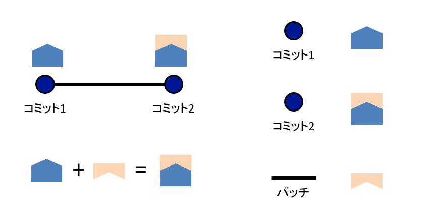

# ブランチ操作

## はじめに

Gitは「玉(コミット)」と「線(コミット間の関係)」で構成された「歴史」を管理するツールだ。コミットは、その時点でのプロジェクトのスナップショットであり、いつでも任意のスナップショットを呼び出したり、差分を調べたりすることができる。

さて、この「歴史」を操作する手段として用意されているのがブランチである。ブランチは単に特定のコミットを指すラベルのようなものであることは既に説明した。Gitでは、このブランチを使って積極的に歴史を分岐、改変させることで開発を進める。

以下では、なぜブランチが必要か、ブランチを使ってどのように開発を進めるのか、「歴史を分岐、改変する」とはどういうことかについて説明する。

## なぜブランチをわけるか

Gitでは原則としてデフォルトブランチ(`master`や`main`)では作業せず、作業開始時にブランチを作成し、歴史を分岐させてから開発を進め、やろうと思った作業がまとまったところでデフォルトブランチにマージする、という開発体制をとる。

## コミットと差分



Gitのコミットは、自分の親コミットを覚えており、それをたどることで歴史をたどることができる。いま、コミット1からコミット2が作られたとする。コミット2にとってコミット1は親コミットになる。この時、それぞれのコミットはその時点でのスナップショットを表しているが、玉と玉をつなぐ線は差分(パッチ)を表している。玉と線からなる歴史は、一つ前の玉が表すコミットに、線が表すパッチを適用することで、次のコミットが得られる、と解釈することができる。この、**コミットの間の線は差分(パッチ)を表す** という事実は今後の説明に重要な役割を果たす。

## ブランチの作成と切り替え

まず、ブランチとコミットについておさらいしておこう。Gitが管理する歴史はコミットがつながったものであり、そのコミットにつけた「ラベル」がブランチだ。特に「いま自分が見ている」場所を指すブランチをカレントブランチと呼ぶ。どのブランチがカレントブランチかを示すのが「HEAD」である。また、コミットとは、新たにコミットを作り、今見ていたコミットにつなげる操作だが、「今見ていたコミット」とは、「HEADが指しているブランチが指しているコミット」のことだ。

コミットをすると、新たにコミットが作られて歴史が伸びる。そして、HEADが指しているブランチ(カレントブランチ)が、新たに作られたコミットを指す。こうして、コミットをする度に、カレントブランチがその先頭に移動していく。

さて、ブランチを作ろう。ブランチはコミットにつけるラベルであるから、任意のコミットを指定して作ることができる。ブランチは`git branch`で作ることができる。

```sh
git branch ブランチ名 ブランチをつけたいコミット
```

ブランチをつけたいコミットは、コミットハッシュの他、別のブランチでも指定できる。

しかし、一番よく使われるのは、カレントブランチに別名を与えることだ。その場合は、`git branch`に与える第二引数は不要で、ブランチ名だけで良い。

```sh
git branch newbranch
```

これにより、`newbranch`というブランチが作られ、カレントブランチが指しているコミットを指す。

この状態では、同じコミットに二つのブランチがついただけだ。この状態で、「今見ているブランチ」を`newbranch`に切り替えよう。ブランチの切り替えは`git switch`を使う。

```sh
git switch newbranch
```

これで、HEADが`master`から`newbranch`を指すようになった。この状態で何か修正してコミットをすると、HEADと`newbranch`は新しいコミットに移動するが、`master`は取り残される。つまり、新しいブランチを作成して切り替える作業は、作業前の状態がどのコミットであったかを保存しておく、という意味を持つ。

なお、`git switch`に`-c`オプションをつけると、ブランチの作成と切り替えを同時に行ってくれる。

```sh
git switch -c newbranch
```

これは以下のコマンドと等価だ。

```sh
git branch newbranch
git switch newbranch
```

通常の作業では`git switch -c`を使うことが多いだろう。

## ブランチ操作(`switch, checkout, merge, branch`)

覚えるコマンド

* switch
* checkout
* merge
* branch
