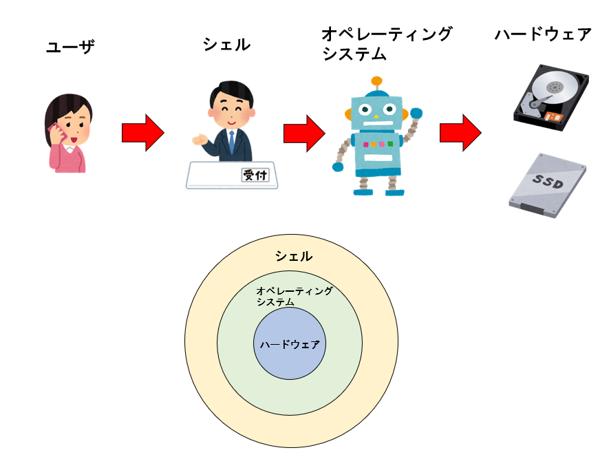
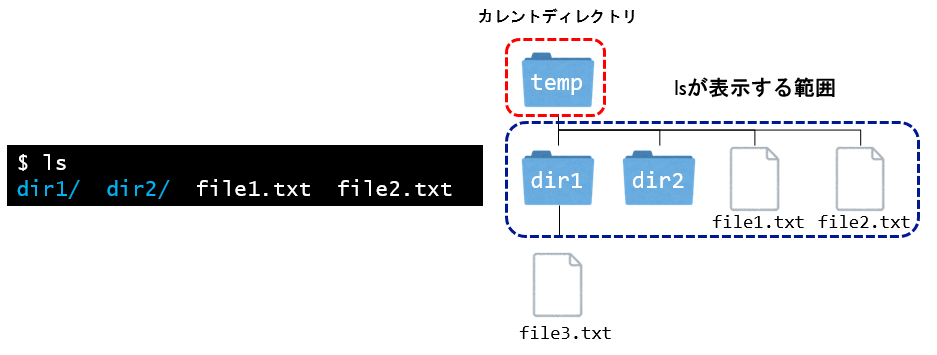

# コマンドラインの使い方

## はじめに

通常、パソコンを操作する際はファイルをマウスでクリックして選択、ダブルクリックで対応するアプリケーションで開いて修正して保存、などとしていることだろう。また、スマホやタブレットは指でタッチして様々な操作を行うであろう。この際、アイコンやボタンなど、操作対象がグラフィカルに表現されたものを、マウスやタッチで操作するインタフェースを **グラフィカルユーザインタフェース(Graphical User Interface, GUI)** と呼ぶ。

一方、主にキーボードからコマンドを入力してコンピュータを操作する方法もある。こちらは命令(コマンド)を一行(ライン)ずつ受け付け、解釈して実行することから **コマンドラインインタフェース(Command-line Interface, CLI)**　と呼ばれる。最初からGUIツールとして作られているWordやPowerPoint等と異なり、Gitはコマンドラインツールとして作られている。GitにはGit Guiや、SourceTreeなどのGUIツールも用意されているが、これはCLIにGUIの「皮」をかぶせたものだ。Gitを「ただ使う」だけであればGUIツールを使えばよいが、本講義の目的はGitを使うことではなく、Gitというバージョン管理ツールを理解することだ。また、GUIツールを使っていて何かトラブルが起きた場合、それがコマンドに起因するものなのか、GUIの「皮」に起因するものなのかを切り分けなければならず、そのためにはコマンドライン操作を理解していなければならない。そこで、まずはコマンドライン操作について学ぶ。

なお、コマンドライン操作において最も注目して欲しいのはエラーへの対応だ。GUIではそもそも「許されない操作」ができないように設計されていることが多いが、コマンドラインでは頻繫に「許されない操作」をしてしまい、「それはできないよ」というメッセージが表示されることだろう。これを **エラーメッセージ(Error Message)** と呼ぶ。エラーの多くは平易な英語で書いてあるので、ちゃんと読めば何が起きたか、そして次に何をすれば良いかがわかるはずだ。

## Unixコマンド

映画などでハッカーが何やら黒い画面を見ながらキーボードをものすごい勢いで叩いているのを見たことがあるだろう。この「黒い画面」はターミナル[^terminal]と呼ばれ、ユーザからの指示をコンピュータに入力するためのものだ。Gitはコマンドラインツールであるから、まずはコマンドラインの使い方に慣れなければならない。コマンドラインを入力するのはこのターミナルという黒い画面であるから、Gitを使うためにはこの「黒い画面」と友達にならなければならない。ターミナルへの命令はコマンドを通じて行われるが、このコマンドはオペレーティング・システムの種類によって異なる。GitはLinuxの開発のために作られた経緯があるため、Linux上で動作することを前提に作られた。LinuxはUnixを参考にして作られたため、Unixの直系の子孫ではないが、操作やコマンドが似ている。Unixは極めて古いOSであり、macOSもUnixの子孫である。Unixの子孫や、Unixと操作が似ているOSをまとめてUnix系システムと呼ぶ。Unix系システムでは、Unixコマンドと呼ばれるコマンド群を用いて操作する。以下では、Gitの操作に最低限必要なUnixコマンドについて説明する。ターミナルはWindowsのGit Bashを想定するが、WSL2のUbuntuやMacのターミナルでも同様である。

[^terminal]: より正確に言えばターミナル(端末)エミュレータのこと。もともと大きなホストコンピュータに、たくさんの端末がぶら下がっており、複数の人が一つのマシンに命令を入力していた。この「端末」をエミュレートしたものが端末エミュレータである。

### シェル

あまり意識していないだろうが、普段使っているパソコンやスマホ、タブレットには **オペレーティングシステム (Operating System, OS)** が搭載されている。Windows 10やmacOS、iOSやAndroidなどがOSだ。OSはハードウェアとソフトウェアの仲立ちをするのが役目だ。例えば、ストレージがハードディスクなのかSSDかによってその制御方法は全くことなるが、OSを介して見れば、どちらも同じファイルシステムに見える。そういう意味でOSはストレージを抽象化している。



さて、いまファイルを作りたいとしよう。OSがストレージを抽象化しているため、ユーザはOSに「ファイルを作ってください」と依頼する必要がある。この、ユーザとOSの仲立ちをするのが **シェル(shell)** と呼ばれるシステムだ。ユーザは、ターミナル(黒い画面)から、シェルに命令を入力する。するとシェルはそれをOSに届け、OSが実際に処理を行う、という階層構造になっている[^kernel]。OSはハードウェアを抽象化し、さらにその周りを殻のように覆っていることからシェルという名前がついたようだ。

[^kernel]: より正確に言えば、シェルはOSの一部であり、ハードウェアを抽象化しているのはカーネル(kernel)と呼ばれるプログラムであるが、ここではOSとカーネルの区別はしないことにする。

シェルには、グラフィカルなシェルと、コマンドラインシェルがある。Windowsなどではグラフィカルなシェルが用意されており、マウスでファイルの移動をすることができる。一方、ターミナル上でコマンドを入力することで命令を実行するのがコマンドラインシェルである。以下では、コマンドラインシェルのことを単に「シェル」と呼ぶことにする。

### コマンドプロンプト

多くのシェルでは、ユーザからの入力を待っている時に`$`が表示され、その隣でカーソルが点滅した状態となる。

```sh
$ 
```

これをコマンドプロンプト、あるいは単にプロンプトと呼び、コマンドが入力可能であることを表している。このプロンプトにコマンドを入力し、エンターキーを押すとその命令が処理される。コマンドに何か値を渡したいことがある。例えばファイルを削除するコマンドは`rm`だが、どのファイルを削除するか教えてやる必要がある。このように、コマンドに渡す値を **引数(ひきすう)** と呼ぶ。一方、コマンドの動作を変えるような引数を **オプション(option)** と呼び、`-`や`--`で始まることが多い。

WindowsやMacでは、複数のファイルをまとめるものをフォルダと呼ぶが、Unix系システムでは　**ディレクトリ(directory)** と呼ぶ。

この命令が実行されるディレクトリ、すなわち「いま自分がいるディレクトリ」をカレントディレクトリ、もしくはワーキングディレクトリと呼ぶ。特に、ターミナルを開いた直後のカレントディレクトリを **ホームディレクトリ(Home directory)** と呼ぶ。

### `ls`

カレントディレクトリに存在するディレクトリやファイルを表示するコマンドが`ls`だ[^ls]。

[^ls]: `list`の略だと思われる。

```sh
$ ls
```

上記は、`$`というコマンドプロンプトに、`ls`という文字を入力し、エンターキーを押す、という意味だ。ユーザが入力するのは`ls`(+エンターキー)だけであり、`$`は入力しないことに注意。

すると、例えば以下のような表示がされる。

```sh
$ ls
dir1/  dir2/  file1.txt  file2.txt
```

これは、カレントディレクトリに、`dir1`、`dir2`というディレクトリと、`file1.txt`、`file2.txt`というファイルがあるよ、という意味だ。ディレクトリは名前の右側に`/`がついていることが多いが、それはシェルの設定によるため、ついていない場合もある。



`ls`に`-l`というオプションを渡すと、結果をリスト表示する。

```sh
$ ls -l
total 0
drwxr-xr-x 1 watanabe 197121 0  8月 17 21:03 dir1/
drwxr-xr-x 1 watanabe 197121 0  8月 17 20:32 dir2/
-rw-r--r-- 1 watanabe 197121 0  8月 17 20:33 file1.txt
-rw-r--r-- 1 watanabe 197121 0  8月 17 20:33 file2.txt
```

リスト表示では、ファイル名の他に、そのファイルの読み書きの許可、所有者、日付などが表示される。このように、「コマンドの直接の目的語」が引数、「コマンドの振る舞いを変える」のがオプションである。

引数としてカレントディレクトリの下にあるディレクトリ(サブディレクトリと言う)を指定することで、そのディレクトリの中身を表示することもできる。

```sh
$ ls dir1
file3.txt
```

存在しないファイルやディレクトリを指定すると、そんなファイルは知らないよ、というエラーが出る。

```sh
$ ls non-existing-dir
ls: cannot access 'non-existing-dir': No such file or directory
```

頭に`.`がついているファイルやディレクトリは隠しファイル、隠しディレクトリとなり、デフォルトでは表示されない。それを表示するには`ls -a`オプションを使う。

```sh
$ ls -a
./  ../  dir1/  dir2/  file1.txt  file2.txt
```

新たに表示された`.`と`..`は、それぞれカレントディレクトリと親ディレクトリの別名だ。どちらも良く使うので覚えておきたい。

### `cd`

カレントディレクトリを変更するコマンドが`cd`だ[^cd]。`cd`の後にディレクトリ名を指定すると、カレントディレクトリがそこに移動する。ダブルクリックでフォルダを開いた時には、そのフォルダの中身が自動的に表示された。しかし、コマンドラインインタフェースではそんな親切なことはしてくれない。カレントディレクトリをそのディレクトリに変更しておしまいである。中身を表示したければ`cd`した後に`ls`を実行しよう。

[^cd]: `change directory`の略だと思われる。

```sh
$ cd dir1
$ ls
file3.txt
```


存在しないディレクトリに移動しようとしたら、エラーが出る。

```sh
$ cd non-exisiting-dir
bash: cd: non-exisiting-dir: No such file or directory
```

これは「`non-exisiting-dir`というディレクトリに`cd`しようとしたけど、そんなファイルもディレクトリも無いよ」というエラーだ。ファイルに対して`cd`しようとしてもエラーとなる。

```sh
$ cd file1.txt
bash: cd: file1.txt: Not a directory
```

これは「`file1.txt`はディレクトリではないので`cd`できないよ」というエラーだ。

`cd`コマンドを引数無しで実行すると、ホームディレクトリに戻る。重要なコマンドなので覚えておこう。

`..`は親ディレクトリを表すため、`cd ..`を実行するとカレントディレクトリが一つ上に移動する。

```sh
$ ls
dir1/  dir2/  file1.txt  file2.txt
$ cd dir1 # dir1に移る
$ ls
file3.txt
$ cd ..   #一つ上に戻る
$ ls
dir1/  dir2/  file1.txt  file2.txt
```

### `mkdir`

ディレクトリを作るには`mkdir`を使う[^mkdir]。

```sh
$ ls
dir1/  dir2/  file1.txt  file2.txt

$ mkdir dir3 # dir3を作成
$ ls
dir1/  dir2/  dir3/  file1.txt  file2.txt # dir3/が増えた
```

[^mkdir]: `make directory`の略であろう。

### `mv`

### `rm`

## Vim

Vimの使い方。

## 余談：OSの系譜とドラマ

WordやPowerPointなど、普段使うアプリケーションは、オペレーティング・システムの上で動作している。オペレーティング・システム(OS)は、基本ソフトとも呼ばれ、ハードウェアとアプリケーションの間で動作する。その存在を意識することは少ないが、PCやスマホ、タブレットなどのデバイスの使い勝手を大きく左右する重要なソフトウェアである。普段よく目にするOSは、PCならWindowsかmacOS、スマホならAndroidかiOSであろう。WindowsはMicrosoft、macOSやiOSはApple、AndroidはGoogleが開発している。OSは日々進化しており、どんどん新しい機能が追加されていく。その進化に乗り遅れたOSは市場から淘汰されてしまうため、その裏には様々なドラマがある。そのうちWindows 95とmacOSの話を紹介したい。

1980年代、MS-DOS、そしてWindows 3.1というOSにより大きなシェアを獲得したMicrosoftは、二つのOSの開発を進めていた。一つはコンシューマ向けの「使いやすい」OS、もう一つはサーバ向けの「信頼性の高い」OSだ。後者はWindows NTとして完成するが、その時の筆舌に尽くしがたい「デスマーチ」の様子が「闘うプログラマー」に記述があるので興味のある人は読んで見ると良いであろう。さて、もう一つの「家庭用」のOS開発プロジェクトは「カイロ」という名前で進められていたが、進捗が悪かった。そこで、「シカゴ」という別プロジェクトが走り出す。情報科学で博士号を取ったような人ばかりで構成された「カイロ」と、職人プログラマを寄せ集めたような「シカゴ」、どちらがMicrosoftの次世代OSを担うか、ビル・ゲイツの前で「裁判」が行われる。「カイロ」は400ページに渡る資料を用意し、いかに「シカゴ」がダメかを論じたのに対して、「シカゴ」チームはただ一枚のCD-ROMを取り出し、開発中のOSを実演してみせた。両方の言い分を聞いたビル・ゲイツは即座にカイロのキャンセルを決断。その時にCD-ROMに入っていたOSは、後に大ブームを巻き起こすことになるWindows 95のベータ版であった。負けた「カイロ」を率いていたリーダー、ジム・オールチンは、後にWindows Vistaの開発を率いることになり、そこにも面白いストーリーがあるのだが、ここでは割愛しよう。

macOS開発のドラマも面白い。1984年、Appleはグラフィックを重視するコンピュータ、Macintoshを発売する。MS-DOS等、他のOSがコマンドラインインタフェースを採用することがほとんどであった当時、マウスで直感的に操作できるグラフィカルなシェルを搭載したOSは画期的であり、GUIという概念の普及に大きく貢献した。OSは「System」と呼ばれ、ハードと一体で開発されていた。Systemは優れたOSであったが、長く開発が続けられるうちに設計が古くなり、不安定になっていった。Microsoftと同様に、1980年代後半から次世代OSの必要性を痛感していたAppleは「コープランド(copland)」というプロジェクトを立ち上げ、新しいOSの開発をすすめる。しかし、必要と思われる機能を際限なく仕様に追加していった結果、プロジェクトは収集がつかなくなり、AppleはOSの自社開発を断念、外部から調達することを決断する。次世代Mac OSの候補は二つ、かつてAppleで開発責任者を務めたジャン＝ルイ・ガセー独立し、設立したBe社が開発したBeOSと、Appleの創業者でありながら、自らが引き抜いたCEOにAppleを追い出されたスティーブ・ジョブズが設立したNeXT社が開発したOPENSTEPである。ガセーは勝利を確信していたフシがあり、プレゼンに力を入れなかったが、ジョブズは完璧なプレゼンを行い、結果、次世代OSの座を獲得したのはOPENSTEPとなり、ジョブズはAppleに返り咲く。ジョブズがAppleを去ったのは、ガセーによる密告が原因という話もあり、そのあたりの「ドラマ」も興味深い。

MicrosoftはしばらくWindows 95系列とWindows NT系列を両方開発していたが、両者はWindows XPにて統合され、Windows 95系列はWindows Meを最後に開発を終えた。MacのOSは、当初Macintosh搭載のSystemとしてスタートしたが、Mac OS 9を最後にOPENSTEP由来のMacOS Xに移行し、役目を終えた。中身は完全に変わったが、どちらも「Windows」「Mac」として開発、発売が続いている。OSはソフトウェアであり、ソフトウェアは人が開発するものである以上、人の数だけドラマがある。いまもどこかで次世代OSの開発が進められているのだろう。そこにはどんなドラマが待っているだろうか。

* 参考文献
    * [闘うプログラマー](https://www.amazon.co.jp/dp/4822247570)
    * [米マイクロソフト本社で目の当たりにしたビル・ゲイツの決断力](https://www.huffingtonpost.jp/satoshi-nakajima/bill-gates-microsoft_b_10351956.html)
    * [アップル薄氷の500日](https://www.amazon.co.jp/dp/4797306157)
