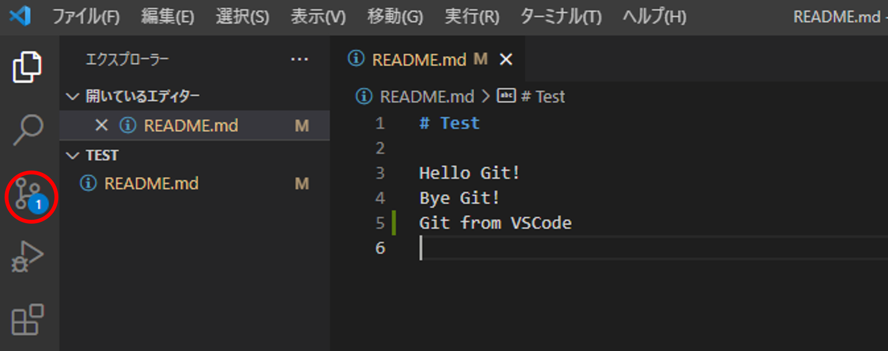
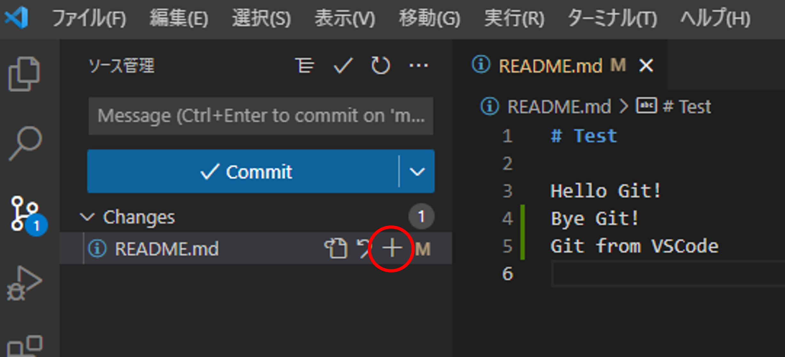

# Gitの操作(基本編)

## 目標

* Gitの初期設定を行う
* コマンドラインでのGitの操作を一通り確認する
* VSCodeからもGitを操作できることを確認する

## 課題: Gitの基本操作

### Step 1: 初期設定

Git Bash (以下、ターミナルと呼ぶ)を開き、以下を実行せよ。

```sh
git config --global user.name "ユーザー名"
git config --global user.email "メールアドレス"
```

この名前とメールアドレスは後に公開されるため、イニシャルやニックネームなどでも良い。また、ここで「タブ補完」が効くことも確認しておこう。

* `git con`まで入力してタブを押すと`git config`まで入力される
* `--gl`まで入力してタブを押すと`--global`まで入力される
* `us`まで入力してタブを押すと`user.`まで入力される
* `n`まで入力してタブを押すと、`name`まで入力される

以上から「git con(TAB)--gl(TAB)us(TAB)n(TAB)」と入力すると`git config --global user.name`まで入力が完了する。これをタブ補完と呼ぶ。慣れると便利なので、普段から意識して使うようにすると良い。

また、デフォルトエディタをVim、改行コードの設定、デフォルトブランチ名を設定をしておこう。

```sh
git config --global core.editor vim
git config --global core.autocrlf false
git config --global init.defaultBranch main
```

次に、よく使うコマンドの省略系(エイリアス)も登録しておこう。いろいろ便利なエイリアスがあるが、人や部署によって流儀が異なるので、今回は以下の一つだけを設定しよう。

```sh
git config --global alias.st "status -s"
```

以上を実行後、ターミナルで`.gitconfig`を表示し、先ほど設定した内容が書き込まれていることを確認せよ。

```sh
cat .gitconfig
```

以下のような表示になっていれば成功である。なお、環境や操作により順序が入れ替わっている場合があるが、同じ内容が記述されていれば問題ない。

```txt
[user]
        name = 先ほど設定したユーザー名
        email = 先ほど設定したメールアドレス
[core]
        editor = vim
        autocrlf = false
[alias]
        st = status -s
[init]
        defaultBranch = main        
```

### Step 2: リポジトリの作成(`git init`)

それではいよいよGitの操作を一通り確認する。

まずは適当なテスト用のディレクトリを作成し、その中で作業しよう。この講義用に`git`というディレクトリを作成し、さらにその中に`test`というディレクトリを作ろう。

```sh
cd
mkdir git
cd git
mkdir test
cd test
```

最初に`cd`を入力しているのは、ホームディレクトリに戻るためだ。これで`git`ディレクトリの下の`test`ディレクトリがカレントディレクトリとなった。プロンプトのカレントディレクトリの表示に`z/git/test`と黄色く表示されていることを確認せよ。以後、`cd`でディレクトリを移動したら、プロンプトからカレントディレクトリを確認する癖をつけておくこと。

この`test`ディレクトリの中に`README.md`というファイルを作成しよう。そして、このディレクトリをVSCodeで開こう。左下の「ここに入力して検索」に「vscode」と入力すると、候補として「Visual Studio Code」が表示されるので選ぶ。なお、初回起動時に言語パックをインストールするか聞かれる場合がある。その場合はインストールして再起動すること。VSCodeが起動したら「ファイル」メニューから「フォルダーを開く(もしくは Open Folder...)」を選び、先ほど作成したディレクトリを選ぼう。フォルダーを開いたら、左のエクスローラーの「TEST」の右にある「新しいファイル」ボタンを押して、`README.md`と入力せよ。`README`まで大文字、`md`が小文字である。


`README.md`ファイルが開かれたら、

```md
# Test

```

とだけ入力し、保存しよう。改行を入れるのを忘れないこと。この際、右下に「CRLF」と表示されている場合は、そこをクリックして「改行コードを選択」画面を出し、「LF」を選ぶこと。

これで、以下のようなディレクトリ構成になったはずだ。

```txt
git
└── test
    └── README.md
```

この状態でターミナルに戻り、リポジトリとして初期化しよう。

```sh
git init
```

すると、`.git`というディレクトリが作成され、`test`ディレクトリがリポジトリとして初期化される。以下を実行せよ。

```sh
ls -la
```

`README.md`に加え、`.git`というディレクトリが作成されたことがわかるはずだ。

`git init`した直後は、「現在のディレクトリ`test`をGitで管理することは決まったが、まだGitはどのファイルも管理していない」、すなわち歴史が全く無い状態になる。

この状態を確認してみよう。以下を実行せよ。

```sh
git status
```

以下のような表示が得られるはずだ。

```txt
On branch main

No commits yet

Untracked files:
  (use "git add <file>..." to include in what will be committed)
        README.md

nothing added to commit but untracked files present (use "git add" to track)
```

ここには、

* まだ何もコミットがなく(No commits yet)
* `README.md`という管理されていないファイルがあるので(Untracked files)
* もし管理したければ`git add`してね(use "git add" to track)

と書いてある。

状態を見るのにいちいちこんな長いメッセージを見せられても困るので、`-s`オプションをつけて見よう。

```sh
git status -s
```

こんな表示がされたはずだ。

```txt
?? README.md
```

`??`と、`?`が二つ表示された。`git status -s`は、ファイルの状態を二つの文字であらわす。それぞれ右がワーキングツリー、左がインデックスの状態を表している。今回のケースはどちらも`?`なので、ワーキングツリーにもインデックスにも無い、すなわちGitの管理下に無い(Untracked)という意味だ。

さて、いちいち`git status -s`と入力するのは面倒なので、最初に`git status -s`に`git st`という別名をつけておいた。以下を実行せよ。

```sh
git st
```

正しくエイリアスが設定されていれば、`git status -s`と入力したのと同じことになる。以後こちらを使うことにしよう。

### Step 3: インデックスへの追加(`git add`)

さて、`Untracked`な状態のファイルをGitの管理下に置こう。そのために`git add`を実行する。

```sh
git add README.md
```

現在の状態を見てみよう。

```sh
git st
```

こんな表示になるはずだ。

```txt
A  README.md
```

これは「`README.md`が追加されることが予約されたよ」という意味で、インデックスに`README.md`が追加された状態になっている。

は、記念すべき最初のコミットをしよう。Gitはコミットをする時に、コミットメッセージが必要となる。最初のメッセージは慣例により`initial commit`とすることが多い。

```sh
git commit -m "initial commit"
```

これによりコミットが作成され、`README.md`はGitの管理下に入った。

状態を見てみよう。

```sh
git st
```

何も表示されないはずである。ロングバージョンのステータスも見てみよう。

```sh
$ git status
On branch main
nothing to commit, working tree clean
```

自分がいまmainブランチにいて、何もコミットをする必要がなく、ワーキングツリーがきれい(clean)、つまりリポジトリが記憶している最新のコミットと一致していることを意味している。

### Step 4: ファイルの修正

次に、ファイルを修正してみよう。VSCodeで開いている`README.md`に、行を付け加えて保存しよう。

```md
# Test

Hello Git!
```

「Hello Git!」の最後の改行を忘れないように。状態を見てみよう。

```sh
$ git st
 M README.md
```

ファイル名の前に`M`という文字がついた。これは`Modified`の頭文字であり、かつ右側に表示されていることから「ワーキングツリーとインデックスに差があるよ」という意味だ。

また、この状態で`git diff`を実行してみよう。

```sh
$ git diff
diff --git a/README.md b/README.md
index 8ae0569..6f768d9 100644
--- a/README.md
+++ b/README.md
@@ -1 +1,3 @@
 # Test
+
+Hello Git!
```

行頭に`+`がついた箇所が追加された行である。

この修正をリポジトリに登録するためにステージングしよう。

```sh
git add README.md
```

また状態を見てみよう。

```sh
$ git st
M  README.md
```

先ほどは赤字で二桁目に`M`が表示されていたのが、今回は緑字で一桁目に`M`が表示されているはずである。これは、インデックスとワーキングツリーは一致しており(二桁目に表示がない)、インデックスとリポジトリに差がある(一桁目に`M`が表示される)ということを意味している。

この状態でコミットしよう。

```sh
git commit -m "adds new line"
```

修正がリポジトリに登録され、ワーキングツリーがきれい(clean)な状態となった。

### Step 5: 自動ステージング(`git commit -a`)

Gitでは原則として

* ファイルを修正する
* `git add`でコミットするファイルをインデックスに登録する(ステージングする)
* `git commit`でリポジトリに反映する

という作業を繰り返す。実際、多人数で開発する場合はこうして「きれいな歴史」を作る方が良いのだが、一人で開発している場合は`git add`によるステージングを省略しても良い。

`git add`を省略するには、コミットする時に`git commit -a`と、`-a`オプションをつける。すると、Git管理下にあり、かつ修正されたファイル全てを、ステージングを飛ばしてコミットする。その動作を確認しよう。

まず、VSCodeでさらにファイルを修正しよう。README.mdに以下の行を付け加えよう。やはり最後の改行を忘れないように。

```md
# Test

Hello Git!
Bye Git!
```

この状態で、`git add`せずに`git commit`しようとすると、「何をコミットするか指定が無いよ(インデックスに何も無いよ)」と怒られる。

```sh
$ git commit -m "modifies README.md"
On branch main
Changes not staged for commit:
  (use "git add <file>..." to update what will be committed)
  (use "git restore <file>..." to discard changes in working directory)
        modified:   README.md

no changes added to commit (use "git add" and/or "git commit -a")
```

上記メッセージには、まず`git add`するか、`git commit -a`しろとあるので、ここでは後者を実行しよう。オプションは`-m`とまとめて`-am`とする。

```sh
git commit -am "modifies README.md"
```

以後、慣れるまでは場合は`git commit -am`を使うことでステージングを省略しても良い。

### Step 6: 歴史の確認(`git log`)

これまでの歴史を確認して見よう。上記の通りに作業して来たなら、3つのコミットが作成されたはずだ。`git log`で歴史を振り返ってみよう。

```sh
$ git log
commit be7533fe7e4f565342bc86c1e8f0f2a9f3c284ae (HEAD -> main)
Author: H. Watanabe <kaityo256@example.com>
Date:   Mon Aug 23 23:32:48 2021 +0900

    modifies README.md

commit dd14099193d5ca080e37674ae474f558457d0cb7
Author: H. Watanabe <kaityo256@example.com>
Date:   Mon Aug 23 23:31:01 2021 +0900

    adds new line

commit 02b8501966eb17df1e2d79c7a33e61feadd678cf
Author: H. Watanabe <kaityo256@example.com>
Date:   Mon Aug 23 23:29:45 2021 +0900

    initial commit
```

いつ、誰が、どのコミットを作ったかが表示される。それぞれのコミットハッシュは異なるものになっているはずだ。

デフォルトの表示では見づらいので、一つのコミットを一行で表示しても良い。

```sh
$ git log --oneline
be7533f (HEAD -> main) modifies README.md
dd14099 adds new line
02b8501 initial commit
```

個人的にはこちらの方が見やすいので、`l`(←小文字のLであり、数字の1ではないことに注意)を`log --oneline`のエイリアスにしてしまっても良いと思う。もしそうしたい場合は、

```sh
git config --global alias.l "log --oneline"
```

を実行せよ。以後、

```sh
git l
```

で、コンパクトなログを見ることができる。

### Step 7: VSCodeからの操作

Gitは、VSCodeからも操作することができる。今、`README.md`を開いているVSCodeで何か修正して、保存してみよう。例えば以下のように行を追加する。

```md
# Test

Hello git
Bye git
Git from VSCode

```

修正を保存した状態で左を見ると、「ソース管理」アイコンに「1」という数字が表示されているはずだ。これは「Gitで管理されているファイルのうち、一つのファイルが修正されているよ」という意味だ。



この「ソース管理アイコン」をクリックしよう。



すると、ソース管理ウィンドウが開き、「変更」の下に「README.md」がある。うまく表示されない場合はエクスプローラーから「エクスプローラーを最新表示する(Refresh)」をクリックし、最新表示としよう。

そのファイル名の右にある「+」マークをクリックしよう。README.mdが「変更」から「ステージング済みの変更」に移動したはずだ。

これはGit Bashで

```sh
git add README.md
```

を実行したことに対応する。

この状態で「メッセージ」のところにコミットメッセージを書いて、上の「チェックマーク」をクリックすると、コミットできる。例えばメッセージとして「commit from VSCode」と書いてコミットしてみよう。


これでコミットができた。これは、Git Bashで

```sh
git commit -m "commit from VSCode"
```

を実行したことに対応する。ちゃんとコミットされたかどうか、ターミナルから確認してみよう。

```sh
$ git log --oneline
0c18b48 (HEAD -> main) commit from VSCode
be7533f modifies README.md
dd14099 adds new line
02b8501 initial commit
```

VSCodeから作ったコミットが反映されていることがわかる。

基本的にVSCodeからGitの全ての操作を行うことができるが、当面の間はコマンドラインから実行した方が良い。慣れてきたらVSCodeその他のGUIツールを使うと良いだろう。

### レポート課題

上記全ての操作を行い、最後に

```sh
git log --oneline
```

を実行した結果をレポートとして提出せよ。

## 余談：データベース"ふっとばし"スペシャリスト

誰かが会社に甚大な被害をもたらす大きなミスをしたとしよう。そのリカバリ作業のため、多くの人が残業を余儀なくされた状況で、ミスをした本人が「先に帰ります」と家に帰ったらどう思うだろうか？「非常識だ」と思う人が多いのではないだろうか？しかし、実際大きなミスをした人がリカバリ作業からすぐに離脱し、それを誰も咎めなかったケースがある。GitLabのデータベース障害対応だ。

GitLabは、GitHubと同様にGitのリポジトリをホスティングするサービスを運営している会社である。日本時間で2017年2月1日、そのGitLabがサービスを停止し、緊急メンテナンスに入る。原因は人為的なミスによるデータベースの喪失であった。GitLabのデータベースはプライマリ(本番)とセカンダリ(待機系)の二つを持っており、二つが同期する仕組みとなっていた。しかし当日、スパムユーザからの攻撃をうけ、データベースが過負荷状態になり、同期がうまくいかなくなっていた。データベースを管理していたエンジニアはこのトラブルに長時間対応し、疲れていたようだ。現地時間で23時、彼は不要なデータを削除してから再度同期しようとして、セカンダリデータベースのディレクトリを削除する。しかし、その数秒後、彼は操作したのがバックアップのセカンダリではなく、プライマリのデータであったことに気づく。すぐに削除を停止したが時すでに遅く、ほとんどのデータは失われてしまった。GitLabはこういう時のためにデータベースをバックアップするコマンドを定期的に実行する仕組みを導入していたが、バージョン違いによるエラーが発生しており、しばらく前からバックアップに失敗していることに気づかなかった。その他のいくつかのバックアップも機能していなかったことが判明し、バックアップはたまたま事故の6時間前にとられたスナップショットのみであった。この頼みの綱のスナップショットから復旧作業が始まったが、この時、データベースをふっとばしたエンジニアは「自分はもうsudoコマンドを実行しない方が良いだろう」と、復旧作業を別の人に依頼。そして事故から1日後、GitLabは復旧作業を完了し、全てのサービスを再開した。

ここで、データベースをふっとばした張本人が、早々に復旧作業から離脱していることに注意して欲しい。私はこれは正しい判断だったと思う。自分が会社に巨額の損失を与えるような失敗をしてしまったことを想像してみよう。「自分の責任だから自分で挽回しよう」とか「ミスをした贖罪として寝ずに仕事をしよう」と考えてしまう人が多いのではないだろうか？しかし、すでに長時間作業をして疲れており、大きなミスをして動揺している状態で復旧作業に参加しても、また大きなミスをしてしまう可能性が高い。「頼みの綱」のスナップショットを失ったら、GitLabはサービスを再開できなくなってしまう。それなら復旧作業は信頼できる同僚にまかせて、自分は休んでから別の作業で復帰したほうが良い。GitLabは事故の詳細を(人為ミスであることも含めて)すぐに公表し、リカバリ作業をYouTubeのストリーミング放映、Twitterでも進捗を報告、事故の詳細も隠さずにリアルタイムに公表していった。筆者もリアルタイムで復旧作業のストリーミング映像を見たが、エンジニアが淡々と作業しており、そこに悲壮感などはなかった。GitLabが復旧を完了し、サービス再開を告げたツイートには、「よくやった」「事故対応の透明性が素晴らしい」など多くの賛辞が寄せられた。このように、ミスや問題を報告しやすい雰囲気を「心理安全性が高い」と言う。ミスをした人が先に帰っても問題視されず、自社が犯したミスを(バックアップが動作していなかったことまで含めて)包み隠さず公開したGitLabは、間違いなく心理安全性が高い会社と言えよう。

なお、この事故のあとしばらくの間、データベースをふっとばしたエンジニアはGitLabの自分のページで「データベース"ふっとばし"スペシャリスト (Database "removal" specialist)」と名乗っていた。

* [GitLab.com database incident](https://about.gitlab.com/blog/2017/02/01/gitlab-dot-com-database-incident/)
* [GitLab.comが操作ミスで本番データベース喪失。5つあったはずのバックアップ手段は役立たず、頼みの綱は6時間前に偶然取ったスナップショット](https://www.publickey1.jp/blog/17/gitlabcom56.html) 2021年8月20日閲覧
