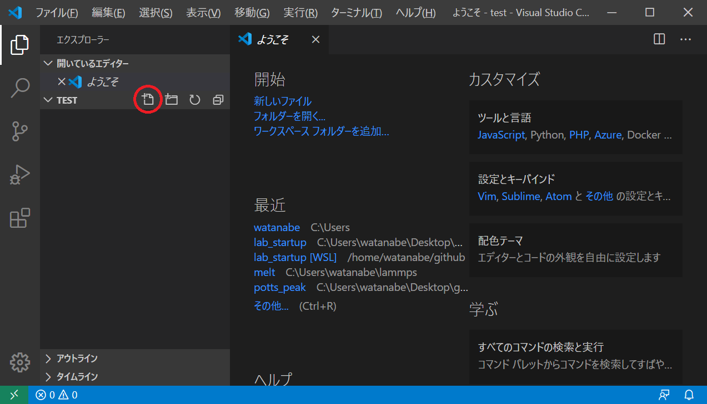

# Gitの操作

## 目標

* Gitの初期設定を行う
* コマンドラインでのGitの操作を一通り確認する
* VSCodeの設定と操作を覚える

## 初期設定

Git Bash (以下、ターミナルと呼ぶ)を開き、以下を実行せよ。

```sh
git config --global user.name "ユーザー名"
git config --global user.email "メールアドレス"
```

この名前とメールアドレスは後に公開されるため、イニシャルやニックネームなどでも良い。

また、念のためにデフォルトエディタをVimにしておこう。

```sh
git config --global core.editor vim
```

次に、よく使うコマンドの省略系(エイリアス)も登録しておこう。

```sh
git config --global alias.st "status -s"
```

以上を実行後、ターミナルで`.gitconfig`を表示し、先ほど設定した内容が書き込まれていることを確認せよ。

```sh
cat .gitconfig
```

以下のような表示になっていれば成功である。

```txt
[user]
        name = 先ほど設定したユーザー名
        email = 先ほど設定したメールアドレス
[core]
        editor = vim
[alias]
        st = status -s
```

## Gitの操作

それではいよいよGitの操作を一通り確認する。

### リポジトリの作成

まずは適当なテスト用のディレクトリを作成し、その中で作業しよう。この講義用に`git`というディレクトリを作成し、さらにその中に`test`というディレクトリを作ろう。

```sh
cd
mkdir git
cd git
mkdir test
cd test
```

最初に`cd`を入力しているのは、ホームディレクトリに戻るためだ。これで`git`ディレクトリの下の`test`ディレクトリがカレントディレクトリとなった。

この`test`ディレクトリの中に`README.md`というファイルを作成しよう。このディレクトリでVSCodeを起動する。

```sh
code .
```

`code`の後、空白を一つあけてピリオドを入力するのを忘れないこと。

VSCodeが開いたら、左のエクスローラーの「TEST」の右にある「新しいファイル」ボタンを押して、`README.md`と入力せよ。`README`まで大文字、`md`が小文字である。



`README.md`ファイルが開かれたら、

```md
# Test
```

とだけ入力し、保存しよう。これで、以下のようなディレクトリ構成になったはずだ。

```txt
git
└── test
    └── README.md
```

この状態でターミナルに戻り、リポジトリとして初期化しよう。

```sh
git init
```

すると、`.git`というディレクトリが作成され、`test`ディレクトリがリポジトリとして初期化される。以下を実行せよ。

```
ls -la
```

`README.md`に加え、`.git`というディレクトリが作成されたことがわかるはずだ。

`git init`した直後は、「現在のディレクトリ`test`をGitで管理することは決まったが、まだGitはどのファイルも管理していない」、すなわち歴史が全く無い状態になる。

この状態を確認してみよう。以下を実行せよ。

```sh
git status
```

以下のような表示が得られるはずだ。

```txt
On branch master

No commits yet

Untracked files:
  (use "git add <file>..." to include in what will be committed)
        README.md

nothing added to commit but untracked files present (use "git add" to track)
```

ここには、

* まだ何もコミットがなく(No commits yet)
* `README.md`という管理されていないファイルがあるので(Untracked files)
* もし管理したければ`git add`してね(use "git add" to track)

と書いてある。

状態を見るのにいちいちこんな長いメッセージを見せられても困るので、`-s`オプションをつけて見よう。

```sh
git status -s
```

こんな表示がされたはずだ。

```txt
?? README.md
```

`??`と、`?`が二つ表示された。`git status -s`は、ファイルの状態を二つの文字であらわす。それぞれ右がワーキングツリー、左がインデックスの状態を表している。今回のケースはどちらも`?`なので、ワーキングツリーにもインデックスにも無い、すなわちGitの管理下に無い(Untracked)という意味だ。

さて、いちいち`git status -s`と入力するのは面倒なので、最初に`git status -s`に`git st`という別名をつけておいた。以下を実行せよ。

```sh
git st
```

正しくエイリアスが設定されていれば、`git status -s`と入力したのと同じことになる。以後こちらを使うことにしよう。