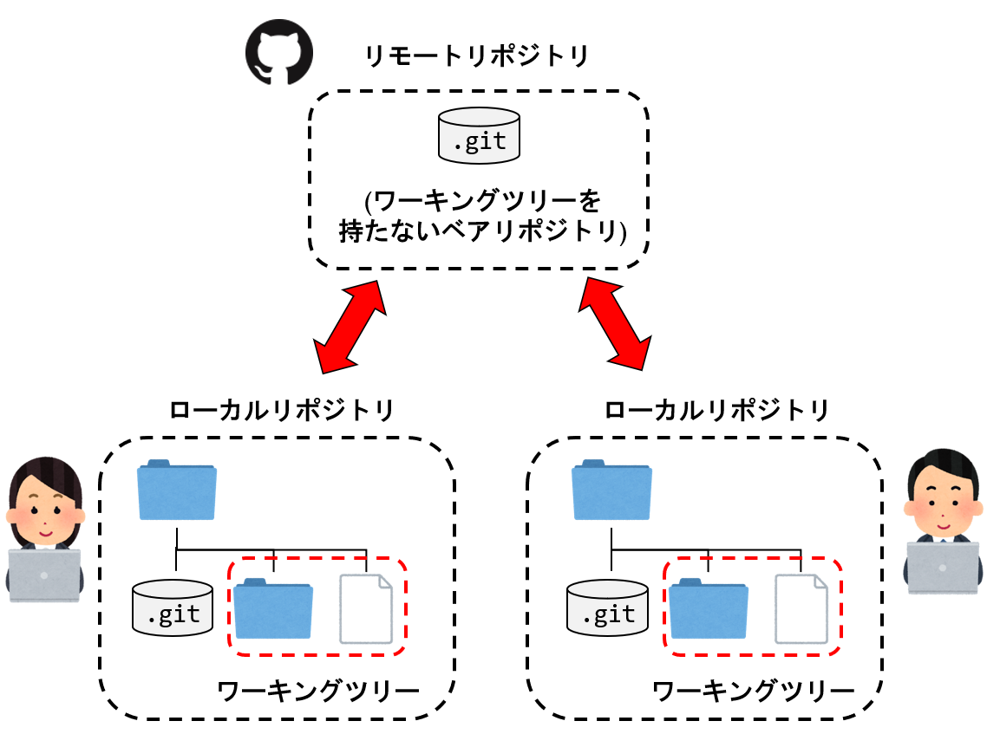

# リモートリポジトリの操作

## はじめに

Gitをローカルだけで使うことはほとんど無く、リモートリポジトリを設定してそこと連携して使うことになるだろう。リモートリポジトリとしては、GitHubやGitLabといったホスティングサービスを使うのが一般的だ。以下では、主にリモートリポジトリのサーバとしてGitHubを想定し、リモートリポジトリとの操作について説明する。

## リモートリポジトリとは



複数の人が同じプロジェクトに所属して開発を進めている時、もしくは個人開発で家のマシンと大学のマシンの両方で開発を進めている時、複数の場所からプロジェクトの最新情報にアクセスできる必要がある。そのような時に使うのがリモートリポジトリだ。この時、リモートリポジトリに負わせる役目には二通りの考え方がある。一つは中央集権型で、履歴など情報を全てリモートリポジトリにのみ保存し、ローカルにはワーキングツリーのみ展開する、というものだ。もう一つは分散型で、リモートにもローカルにも全ての情報を保存しておき、適宜同期させるという方針を取る。Subversionなどが中央集権型であり、Gitは分散型である。分散型はそれぞれのリポジトリが完全な情報を保持していることから互いに対等なのだが、一般的には中央リポジトリという特別なリポジトリを作り、全ての情報を中央リポジトリ経由でアクセスする。この中央リポジトリを置く場所がGitHubである。

## ベアリポジトリ

Git管理下にあるプロジェクトには、ワーキングツリー、インデックス、リポジトリの三つの要素がある。ワーキングツリーは今作業中のファイル、インデックスは「いまコミットをしたら歴史に追加されるスナップショット」を表し、リポジトリはブランチやタグを含めた歴史を保存している。しかしリモートリポジトリはワーキングツリーやインデックスを管理する必要がない。そこで、歴史とタグ情報だけを管理するリポジトリとして **ベアリポジトリ(bare repository)** というものが用意されている。リモートリポジトリはこのベアリポジトリとなっている。ベアリポジトリは`project.git`と、「プロジェクト名+`.git`」という名前にする。Gitの管理情報は、`.git`というディレクトリに格納されているが、ベアリポジトリはその`.git`の中身だけを含むリポジトリであることに由来する。`git init`時に`--bare`オプションをつけるとベアリポジトリを作ることができる。

```sh
git init --bare project.git
```

しかし、リモートサーバとしてGitHubを使うならば、ベアリポジトリを直接作成することはないであろう。ここでは、リモートリポジトリは「プロジェクト名+`.git`」という名前にする、ということだけ覚えておけば良い。

## 認証

ほとんどの場合、リモートリポジトリはネットワークの向こう側に用意する。したがって、なんらかの手段で通信し、かつ認証をしなければならない。GitHubにアクセスする場合、通信手段として大きく分けてSSHとHTTPSの二つが存在する。認証とは、「確かに自分がそこにアクセスする権限がある」ことを証明する手段であり、SSHでは公開鍵認証を、HTTPSでは個人アクセストークン(Personal Access Token, PAT)により認証をする。本講義ではSSHによる公開鍵認証を用いて、PATは用いない。SSH公開鍵認証については実習で触れる。

## リモートリポジトリの使い方

リモートリポジトリは、単にリモートと呼ぶことが多い。いま、自分が参加している、もしくは自分自身のプロジェクトのリポジトリがリモートにあったとしよう。最初に行うことは、リモートリポジトリからプロジェクトの情報を取ってくることだ。これを **クローン(clone)** と呼ぶ。クローンすると、リモートにある歴史の全てを取ってきた上で、デフォルトブランチ(`master`か`main`)の最新のスナップショットをワーキングツリーとして展開する。このようにして手元のPCに作成されたリポジトリをローカルリポジトリ、もしくは単にローカルと呼ぼう。

さて、ローカルにリポジトリができたら、通常のリポジトリと同様に作業を行う。まずはブランチを切って作業をして、ある程度まとまったらメインブランチにマージする。これにより、メインの歴史がローカルで更新された。この歴史をリモートに反映することを **プッシュ(push)** という。


次にローカルで作業をする際、リモートの情報が更新されているかもしれないので、その情報をローカルに反映する。この作業を **フェッチ (fetch)** という。フェッチによりリモートの情報がローカルに落ちてくるが、ローカルの歴史は修正されない。ローカルの歴史にリモートの修正を反映するにはマージする。リモートの修正をローカルに取り込んだらローカルを修正し、作業が終了したらプッシュによりローカルの修正をリモートに取り込む、というサイクルを繰り返すことで開発が進む。

