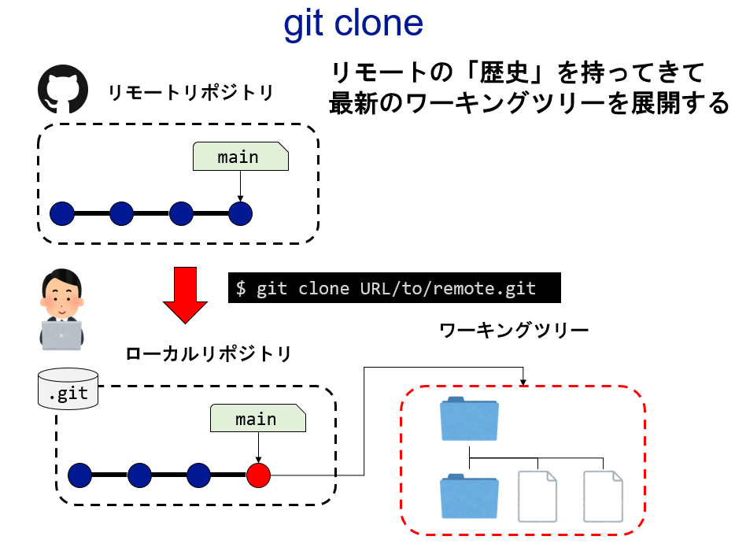
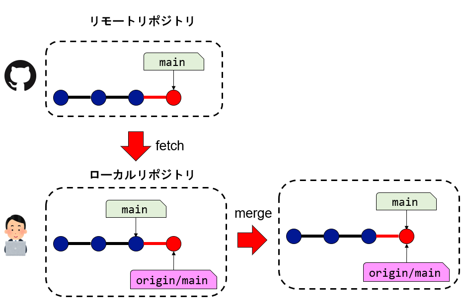
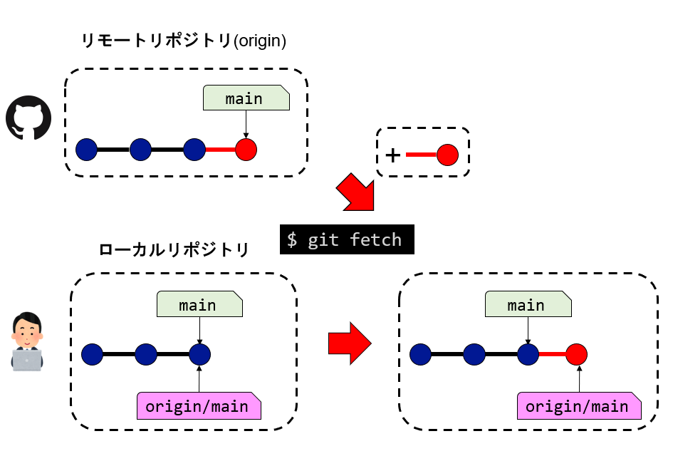
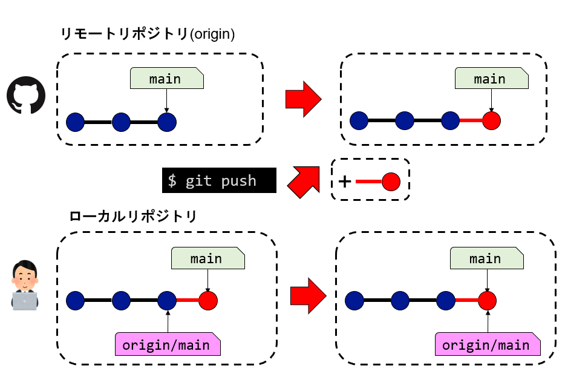
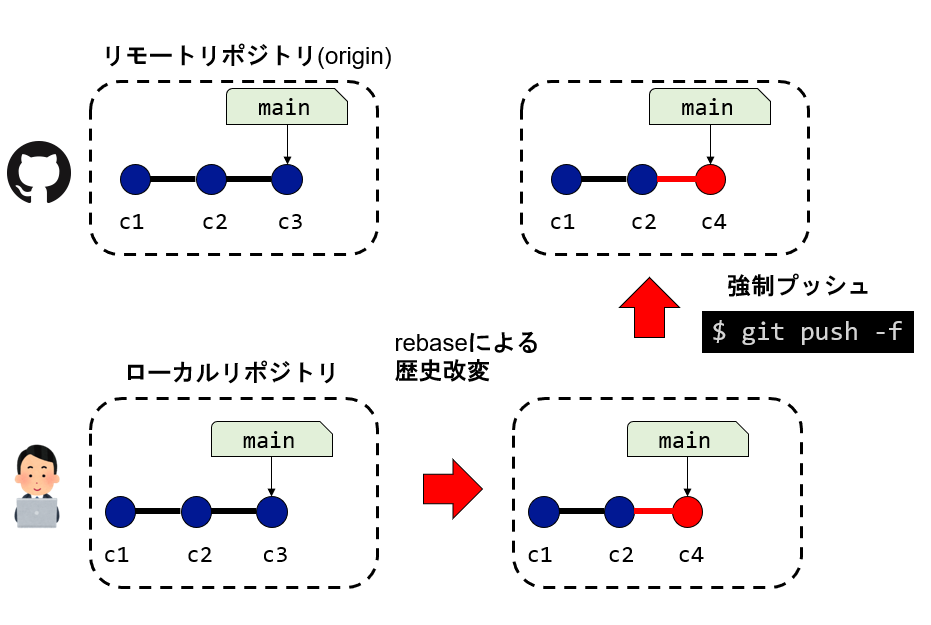
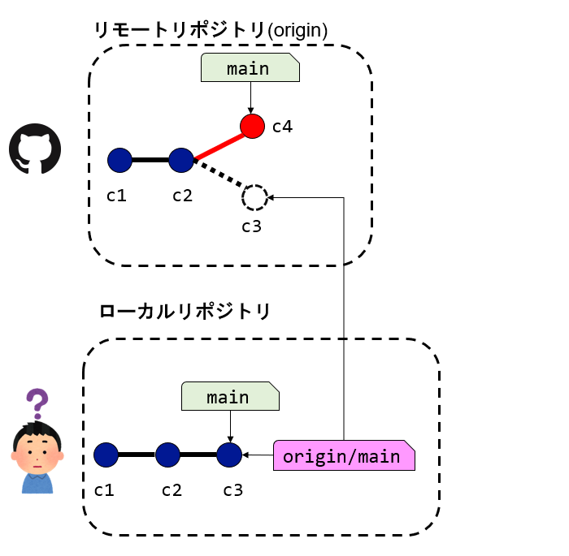

# リモートリポジトリの操作

## はじめに

Gitをローカルだけで使うことはほとんど無く、リモートリポジトリを設定してそこと連携して使うことになるだろう。リモートリポジトリとしては、GitHubやGitLabといったホスティングサービスを使うのが一般的だ。以下では、主にリモートリポジトリのサーバとしてGitHubを想定し、リモートリポジトリとの操作について説明する。

## リモートリポジトリとは


複数の人が同じプロジェクトに所属して開発を進めている時、もしくは個人開発で家のマシンと大学のマシンの両方で開発を進めている時、複数の場所からプロジェクトの最新情報にアクセスできる必要がある。そのような時に使うのがリモートリポジトリだ。この時、リモートリポジトリに負わせる役目には二通りの考え方がある。一つは中央集権型で、履歴など情報を全てリモートリポジトリにのみ保存し、ローカルにはワーキングツリーのみ展開する、というものだ。もう一つは分散型で、リモートにもローカルにも全ての情報を保存しておき、適宜同期させるという方針を取る。Subversionなどが中央集権型であり、Gitは分散型である。分散型はそれぞれのリポジトリが完全な情報を保持していることから互いに対等なのだが、一般的には中央リポジトリという特別なリポジトリを作り、全ての情報を中央リポジトリ経由でアクセスする。この中央リポジトリを置く場所がGitHubである。

Gitでは、複数のリモートリポジトリを登録し、それぞれに名前をつけて管理することができる。しかし、通常は`origin`という名前のリモートリポジトリを一つだけ用意して運用することが多い。以下でもリモートリポジトリは一つだけとし、名前を`origin`とすることを前提とする。

### ベアリポジトリ

Git管理下にあるプロジェクトには、ワーキングツリー、インデックス、リポジトリの三つの要素がある。ワーキングツリーは今作業中のファイル、インデックスは「いまコミットをしたら歴史に追加されるスナップショット」を表し、リポジトリはブランチやタグを含めた歴史を保存している。しかしリモートリポジトリはワーキングツリーやインデックスを管理する必要がない。そこで、歴史とタグ情報だけを管理するリポジトリとして **ベアリポジトリ(bare repository)** というものが用意されている。リモートリポジトリはこのベアリポジトリとなっている。ベアリポジトリは`project.git`と、「プロジェクト名+`.git`」という名前にする。Gitの管理情報は、`.git`というディレクトリに格納されているが、ベアリポジトリはその`.git`の中身だけを含むリポジトリであることに由来する。`git init`時に`--bare`オプションをつけるとベアリポジトリを作ることができる。

```sh
git init --bare project.git
```

しかし、リモートサーバとしてGitHubを使うならば、ベアリポジトリを直接作成することはないであろう。ここでは、リモートリポジトリは「プロジェクト名+`.git`」という名前にする、ということだけ覚えておけば良い。

### 認証とプロトコル

ほとんどの場合、リモートリポジトリはネットワークの向こう側に用意する。したがって、なんらかの手段で通信し、かつ認証をしなければならない。まず、「リポジトリがインターネットのどこにあるか」を指定する必要がある。この、インターネット上の住所と言える文字列を **Uniform Resource Locator (URL)** と呼ぶ。例えばGoogle検索をする際、ブラウザで`https://www.google.com/`にアクセスしているが、この文字列がURLである。

GitHubにアクセスする場合、通信手段(プロトコル)として大きく分けてSSHとHTTPSの二つが存在する。認証とは、「確かに自分がそこにアクセスする権限がある」ことを証明する手段であり、SSHでは公開鍵認証を、HTTPSでは個人アクセストークン(Personal Access Token, PAT)により認証をする。本講義ではSSHによる公開鍵認証を用いて、PATは用いない。SSH公開鍵認証については実習で触れる。

GitHubのリポジトリには、パブリックなリポジトリとプライベートなリポジトリがある。パブリックなリポジトリは、誰でも閲覧可能だが、プライベートなリポジトリは作者と、作者が許可した人(コラボレータ)しかアクセスできない。また、ローカルの修正をリモートに反映させるには適切な認証と権限が必要となる。

### リモートリポジトリの使い方

リモートリポジトリは、単にリモートと呼ぶことが多い。いま、自分が参加している、もしくは自分自身のプロジェクトのリポジトリがリモートにあったとしよう。最初に行うことは、リモートリポジトリからプロジェクトの情報を取ってくることだ。これを **クローン(clone)** と呼ぶ。クローンすると、リモートにある歴史の全てを取ってきた上で、デフォルトブランチ(`main`)の最新のスナップショットをワーキングツリーとして展開する。このようにして手元のPCに作成されたリポジトリをローカルリポジトリ、もしくは単にローカルと呼ぼう。

さて、ローカルにリポジトリができたら、通常のリポジトリと同様に作業を行う。まずはブランチを切って作業をして、ある程度まとまったらメインブランチにマージする。これにより、メインの歴史がローカルで更新された。この歴史をリモートに反映することを **プッシュ(push)** という。


次にローカルで作業をする際、リモートの情報が更新されているかもしれないので、その情報をローカルに反映する。この作業を **フェッチ (fetch)** という。フェッチによりリモートの情報がローカルに落ちてくるが、ローカルの歴史は修正されない。ローカルの歴史にリモートの修正を反映するにはマージする。リモートの修正をローカルに取り込んだらローカルを修正し、作業が終了したらプッシュによりローカルの修正をリモートに取り込む。以上のサイクルを繰り返すことで開発が進んでいく。以下、それぞれのプロセスを詳しく見てみよう。

## クローン

リモートリポジトリの情報をクローンする時、すなわち、ローカルに初めて持ってくる時には`git clone`を使う。この際、クローン元の場所を指定する必要がある。GitHubのリポジトリをローカルにクローンする際には、通信プロトコルをHTTPSとするかSSHとするかにより、URLが異なる。例えばGitHubの`appi-github`というアカウント(正確にはOrganization)の、`clone-sample`というプロジェクトにアクセスしたい時、それぞれURLは以下のようになる。

* HTTPSの場合：`https://github.com/appi-github/clone-sample.git`
* SSHの場合:`git@github.com:appi-github/clone-sample.git`

`git clone`によりリモートリポジトリをローカルにクローンするには、上記のURLを指定する。

まず、HTTPSプロトコルの場合は以下のように指定する。

```sh
git clone https://github.com/appi-github/clone-sample.git
```

すると、カレントディレクトリに`clone-sample`というディレクトリが作成され、そこにワーキングツリーが展開される。リポジトリがパブリックである場合、誰でもHTTPSプロトコルを用いてクローンすることができる。ただし、ローカルの修正をリモートに反映させる(プッシュする)ためには、個人アクセストークンが必要だ。

SSHプロトコルの場合は以下のようにする。

```sh
git clone git@github.com:appi-github/clone-sample.git
```

パブリックなリポジトリである場合でも、SSHでクローンするためには、公開鍵による認証が必要となる。とりあえず

* 他人が作ったリポジトリを使うためにクローンする場合はHTTPS
* 自分が作ったリポジトリ(もしくはforkしたリポジトリ)を使うためにクローンする場合はSSH

と覚えておけば良い。

クローンにより、それまでの「歴史」全てと、デフォルトブランチの最新のコミットがワーキングツリーとして展開される。



以後は、ローカルリポジトリとして通常通りブランチを作ったり、コミットしたりすることができる。

## プッシュ

ローカルで作業を行い、歴史がリモートよりも進んだとしよう。ローカルの歴史をリモートに反映することをプッシュと呼び、`git push`により行う。


## フェッチ

ローカルにクローン済みのリポジトリがあり、リモートで歴史が進んでいる場合、その歴史をローカルに反映させる必要がある。その時に行うのがフェッチであり`git fetch`により行う。


ここで注意したいのは、`git fetch`は更新された歴史をローカルに持ってきてくれるが、ローカルのブランチは移動しない、ということだ。

実は、リモートの歴史を取ってくる際、リモートにある`main`ブランチは、`origin/main`という名前でローカルに保存される。リモートブランチは`git branch`では表示されないが、`git branch -a`と、`-a`オプションを付けると表示される。

```sh
$ git branch
* main

$ git branch -a
* main
  remotes/origin/HEAD -> origin/main
  remotes/origin/main
```

この時、`remotes/origin/main`というのは、`origin`という名前のリモートリポジトリの`main`ブランチであることを表現している。リモートリポジトリは複数設定することができ、それぞれに自由に名前をつけることができるが、通常はリモートリポジトリは一つだけ設定し、名前を`origin`とすることが多い。



リモートで更新された歴史をフェッチする前は、ローカルリポジトリはリモートが更新されていることを知らないので、`main`と`origin/main`は同じコミットを指している。しかし`git fetch`によりリモートの情報が更新されると、新たに増えたコミットを取り込むと同時に、リモートの`main`ブランチが指しているコミットを、ローカルの`origin/main`ブランチが指す。これにより、リモートの情報がローカルに落ちてきたことになる。

あとは、`origin/main`を通常のブランチと同様に`git merge`することで、リモートの修正をローカルのブランチに取り込むことができる。図ではfast-forward可能な状態であったが、歴史が分岐していた場合でも、ローカルの場合と同様にマージすれば良い。

## 上流ブランチとリモート追跡ブランチ

Gitではローカルにリモートの情報のコピーを用意しておき、それを介してリモートとやりとりする。慣れないとこのやりとりがイメージしづらいので、一度しっかり理解しておきたい。リモートとのやりとりには、特別なブランチを用いる。

いま、リモート(`origin`)にも、ローカルにも`main`というブランチがあるとしよう。Gitでは、リモートにある情報も全てローカルにコピーがある。リモート`origin`の`main`ブランチに対応するブランチは`origin/main`という名前でローカルに保存されている。このブランチを、ローカルの`main`ブランチの **上流ブランチ(upstream branch)** と呼ぶ。最初にクローンした直後、`main`ブランチと共に、「リモートの`main`ブランチ」に対応する`origin/main`というブランチが作成され、自動的に`origin/main`ブランチが`main`ブランチの上流ブランチとして登録される。ローカルの`origin/main`は、リモートの`main`を追跡しており、`git fetch`や`git push`により同期する。リモートの`main`ブランチに対して、`origin/main`を **リモート追跡ブランチ (remote-tracking branch)** と呼ぶ。図解すると以下のようになる。


ローカルの`main`ブランチにとっての「上流」はローカルの`origin/main`ブランチであり、`origin/main`を`main`の上流ブランチと呼ぶまた、ローカルの`origin/main`ブランチはリモートの`main`ブランチをリモート追跡しており、`origin/main`をリモートの`main`ブランチのリモート追跡ブランチと呼ぶつまり`origin/main`は上流ブランチでもリモート追跡ブランチでもあることに注意したい。

最初にリポジトリをクローンした時、メインブランチである`main`ができるが、自動的に上流ブランチ`origin/main`も作成される。ローカルの`main`はローカルの`origin/main`を、ローカルの`origin/main`はリモートの`main`を見ている。

上流ブランチは、`git fetch`、`git merge`、`git rebase`等で、引数を省略した時の対象ブランチとなる。先の`fetch`、`merge`、`push`などの操作を、ブランチがどのように動くかも含めてもう一度見てみよう。

まず、リモートリポジトリの`main`の歴史が、ローカルの`main`よりも進んでいる状態で`git fetch`しよう。`main`に上流ブランチ`origin/main`が設定されており、`origin/main`はリモートの`main`をリモート追跡しているため、これは

```sh
git fetch origin main
```

つまり「リモートリポジトリ`origin`の`main`ブランチの指す情報をローカルとってこい」と同じ意味となる。するとリモートから「進んでいる歴史」分のコミットがローカルに落ちてきて、さらにローカルの`origin/main`ブランチが先に進む。これにより、リモートの`main`と、ローカルの`origin/main`が持つ歴史が同じになった。



次に、`git merge`を実行する。カレントブランチが`main`であり、上流ブランチとして`origin/main`が設定されているため、これは

```sh
git merge origin/main
```

と同じ意味となる。今回のケースではfast-forward可能であるため、単に`main`が`origin/main`の指すのと同じコミットを差すように移動する。これにより、ローカルの`main`がリモートの`main`と同じ歴史を持つようになった。

次にpushを見てみよう。コミットをすることで、ローカルにある`main`ブランチの歴史が進んだ。しかし、`origin/main`はそのままだ。この状態で`git push`をしよう。すると、



すると、ローカルで新たに追加されたコミットがリモートに送られ、リモートの`main`ブランチが先に進む。さらに、ローカルの`origin/main`ブランチも先に進む。これにより、ローカルの`main`ブランチ、`origin/main`ブランチ、リモートの`main`ブランチが全て同じ歴史を共有できた。

まとめると以下のようになる。

* `git fetch`により、リモートの`main`とローカルの`origin/main`が同じ状態になる
* `git merge`により、ローカルの`main`と`origin/main`が同じ状態になる
* `git push`により、、ローカルの`main`と`origin/main`、リモートの`main`が同じ状態になる

実際には`git fetch`や`git push`などはリモートやブランチを自由に指定することができるが、それは必要になった時に覚えれば良い。まずは`main`ブランチのみをリモートと同期させ、`git fetch`や`git push`は引数無しで実行するようにしておこう。

## その他知っておいた方が良いこと

個人開発においては、リモート操作は初回の`git clone`、そして開発中の`git fetch`と`git push`だけ覚えておけばよい。しかし、Gitには他にもリモート操作のためのコマンドがある。リモート操作がらみで気を付けるべきことと合わせて簡単に紹介しておこう。

### `git remote`

リモートリポジトリを管理するコマンドが`git remote`だ。例えば`git remote -v`で、リモートリポジトリのURL等を知ることができる。

適当なリポジトリをHTTPSでクローンしてみよう。

```sh
git clone https://github.com/appi-github/clone-sample.git
```

`clone-sample`というディレクトリができたはずなので、そこに入って`git remote -v`を実行してみよう。

```sh
$ cd clone-sample
$ git remote -v
origin  https://github.com/appi-github/clone-sample.git (fetch)
origin  https://github.com/appi-github/clone-sample.git (push)
```

これは、リモートリポジトリの名前として`origin`が登録されており、`fetch`と`push`の対象となるURLとしてどちらも`https://github.com/appi-github/clone-sample.git`が登録されている、という意味だ。なお、Gitは同じリモートリポジトリの名前で`fetch`と`push`に異なるURLを指定できるが、本講義では扱わない。

もしSSHプロトコルでcloneしていた場合には以下のような表示となる。

```sh
$ git remote -v
origin  git@github.com:appi-github/clone-sample.git (fetch)
origin  git@github.com:appi-github/clone-sample.git (push)
```

`git remote`を普段使うことはあまりないが、既存のローカルリポジトリをGitHubに登録する時には必要となる。その場合は、まずGitHubにベアリポジトリを作っておき、

```sh
git remote add origin git@github.com:アカウント名/project.git
```

などとしてリモートリポジトリをローカルリポジトリに登録する。また、ローカルの`main`ブランチに上流ブランチを設定する必要がある。`git branch -u`で設定することもできるが、最初の`git push`時に`-u`で指定するのが一般的だ。

```sh
git push -u origin main
```

これは

* リモートの`main`をリモート追跡するブランチ`origin/main`ローカルブランチを作る
* 情報をリモートに送信する
* `main`の上流ブランチとして`origin/main`を設定する

という操作を行う。もし`-u`オプションをつけなかった場合、

* リモートの`main`をリモート追跡するブランチ`origin/main`ローカルブランチを作る
* 情報をリモートに送信する

という処理のみ行い、`main`ブランチの上流ブランチの設定はしない。後で`origin/main`を`main`の上流にしたくなった場合はカレントブランチが`main`の状態で

```sh
git branch -u origin/main
```

を実行する。これらの操作についてはGitHubの操作の項で改めて説明する。

### `git pull`

`git pull`を実行すると、`git fetch`と`git merge`を一度に行うことができる。カレントブランチに上流ブランチが設定されている状態で

```sh
git pull
```

を行うと、

```sh
git fetch
git merge
```

を実行したのと同じ状況になる。

しかし、`git pull`の動作は、特に引数を指定した時に直観的でないため、慣れない人が使うとトラブルを起こすことが多い。

慣れるまでは、とりあえず`git pull`の存在は忘れ、`git fetch`してから、`git merge`する習慣をつければ良い。

### プッシュしたブランチをリベースしない

リモートリポジトリとローカルリポジトリの「歴史」は`git fetch`や`git push`により同期することができる。`git fetch`をした場合、Gitはローカルの`origin/main`が指すコミットと、リモートの`main`が指すコミットを比較することで「差分」を検出する。したがって、`git fetch`をする場合、ローカルの`origin/main`が指すコミットがリモートに存在することが前提となる。`push`も同様だ。

普通に作業をしていれば、歴史は増える一方で減ることはないから、昔存在したコミットが消えることはなく、`origin/main`が指すコミットは必ずリモートに存在することになる。しかし、Gitには歴史を改変できるコマンドがある。`git rebase`だ。

`git rebase`により歴史を改変すると、リモートとローカルで歴史が食い違ってしまう。すると、`git push`は差分の追加だけ(fast forward)でリモートを更新することができなくなる。

このような時のために、`git push`に`-f`オプションをつけることで、無理やりpushする、force pushというオプションが用意されている。

```sh
git push -f
```

これにより無理やりローカルの歴史をリモートに反映させることができる。



しかし、push済みの歴史が改変されてしまうと、他のローカルリポジトリの持つ歴史と矛盾することになる。もともとリモートの`main`は`c3`というコミットを指していた。その状態でクローンしたリポジトリは、`origin/main`が`c3`を指すことになる。ところが、そのあとリベースにより改変された歴史が強制プッシュされてしまうと、`origin/main`が指していた`c3`というコミットがなくなってしまう。



多人数開発であればもちろんの事、個人の開発でも、家と大学のPCでリポジトリの歴史に矛盾が出たら混乱することが予想できるであろう。

慣れるまでは、原則として

* プッシュ済みのブランチ(特に`main`や`master`)はリベースしない(リベースはローカルブランチのみ)
* force push (`git push -f`)は使わない

ということを守れば良い。もし「しまった！」と思った場合、ほとんどの場合、force pushする前であればなんとかなることが多いので、自分で解決しようとせず近くにいるGitに詳しい人に助けを求めること。

## まとめ

Gitでは、リモートリポジトリとやりとりをすることで開発を進める。通常、リモートリポジトリは一つだけであり、`origin`という名前を付ける。通常の開発の流れは以下のようになるだろう。

1. `git fetch`によりリモートの更新をダウンロード
2. `git merge`によりリモートの更新を取り込む
3. `git switch -c newbranch`により新たに`newbranch`ブランチを切って作業開始
4. 作業修了したら(好みに応じて`newbranch`ブランチから`main`にリベースしてから)`main`から`newbranch`をマージする
5. `git push`する

リモートリポジトリとはリモート追跡ブランチを使って情報を同期する。ローカルにある`origin/main`ブランチは、リモート`origin`の`main`ブランチをリモート追跡するブランチであり、また多くの場合においてローカルの`main`ブランチの上流ブランチでもある。

Gitのリモートがらみには、`git pull`や、`git push -f`など、危険なコマンドがある。意味を完全に理解するまではこれらのコマンドを使わないようにすると良いだろう。
