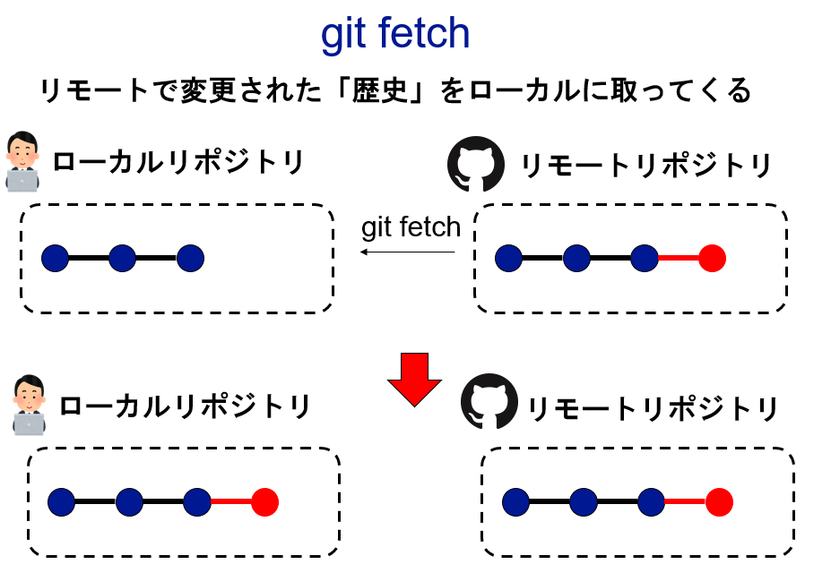

# リモートリポジトリの操作

## はじめに

Gitをローカルだけで使うことはほとんど無く、リモートリポジトリを設定してそこと連携して使うことになるだろう。リモートリポジトリとしては、GitHubやGitLabといったホスティングサービスを使うのが一般的だ。以下では、主にリモートリポジトリのサーバとしてGitHubを想定し、リモートリポジトリとの操作について説明する。

## リモートリポジトリとは


複数の人が同じプロジェクトに所属して開発を進めている時、もしくは個人開発で家のマシンと大学のマシンの両方で開発を進めている時、複数の場所からプロジェクトの最新情報にアクセスできる必要がある。そのような時に使うのがリモートリポジトリだ。この時、リモートリポジトリに負わせる役目には二通りの考え方がある。一つは中央集権型で、履歴など情報を全てリモートリポジトリにのみ保存し、ローカルにはワーキングツリーのみ展開する、というものだ。もう一つは分散型で、リモートにもローカルにも全ての情報を保存しておき、適宜同期させるという方針を取る。Subversionなどが中央集権型であり、Gitは分散型である。分散型はそれぞれのリポジトリが完全な情報を保持していることから互いに対等なのだが、一般的には中央リポジトリという特別なリポジトリを作り、全ての情報を中央リポジトリ経由でアクセスする。この中央リポジトリを置く場所がGitHubである。

### ベアリポジトリ

Git管理下にあるプロジェクトには、ワーキングツリー、インデックス、リポジトリの三つの要素がある。ワーキングツリーは今作業中のファイル、インデックスは「いまコミットをしたら歴史に追加されるスナップショット」を表し、リポジトリはブランチやタグを含めた歴史を保存している。しかしリモートリポジトリはワーキングツリーやインデックスを管理する必要がない。そこで、歴史とタグ情報だけを管理するリポジトリとして **ベアリポジトリ(bare repository)** というものが用意されている。リモートリポジトリはこのベアリポジトリとなっている。ベアリポジトリは`project.git`と、「プロジェクト名+`.git`」という名前にする。Gitの管理情報は、`.git`というディレクトリに格納されているが、ベアリポジトリはその`.git`の中身だけを含むリポジトリであることに由来する。`git init`時に`--bare`オプションをつけるとベアリポジトリを作ることができる。

```sh
git init --bare project.git
```

しかし、リモートサーバとしてGitHubを使うならば、ベアリポジトリを直接作成することはないであろう。ここでは、リモートリポジトリは「プロジェクト名+`.git`」という名前にする、ということだけ覚えておけば良い。

### 認証と権限

ほとんどの場合、リモートリポジトリはネットワークの向こう側に用意する。したがって、なんらかの手段で通信し、かつ認証をしなければならない。まず、「リポジトリがインターネットのどこにあるか」を指定する必要がある。この、インターネット上の住所と言える文字列を **Uniform Resource Locator (URL)** と呼ぶ。例えばGoogle検索をする際、ブラウザで`https://www.google.com/`にアクセスしているが、この文字列がURLである。

GitHubにアクセスする場合、通信手段(プロトコル)として大きく分けてSSHとHTTPSの二つが存在する。認証とは、「確かに自分がそこにアクセスする権限がある」ことを証明する手段であり、SSHでは公開鍵認証を、HTTPSでは個人アクセストークン(Personal Access Token, PAT)により認証をする。本講義ではSSHによる公開鍵認証を用いて、PATは用いない。SSH公開鍵認証については実習で触れる。

GitHubのリポジトリには、パブリックなリポジトリとプライベートなリポジトリがある。パブリックなリポジトリは、誰でも閲覧可能だが、プライベートなリポジトリは作者と、作者が許可した人(コラボレータ)しかアクセスできない。また、ローカルの修正をリモートに反映させるには適切な認証と権限が必要となる。

### リモートリポジトリの使い方

リモートリポジトリは、単にリモートと呼ぶことが多い。いま、自分が参加している、もしくは自分自身のプロジェクトのリポジトリがリモートにあったとしよう。最初に行うことは、リモートリポジトリからプロジェクトの情報を取ってくることだ。これを **クローン(clone)** と呼ぶ。クローンすると、リモートにある歴史の全てを取ってきた上で、デフォルトブランチ(`main`)の最新のスナップショットをワーキングツリーとして展開する。このようにして手元のPCに作成されたリポジトリをローカルリポジトリ、もしくは単にローカルと呼ぼう。

さて、ローカルにリポジトリができたら、通常のリポジトリと同様に作業を行う。まずはブランチを切って作業をして、ある程度まとまったらメインブランチにマージする。これにより、メインの歴史がローカルで更新された。この歴史をリモートに反映することを **プッシュ(push)** という。


次にローカルで作業をする際、リモートの情報が更新されているかもしれないので、その情報をローカルに反映する。この作業を **フェッチ (fetch)** という。フェッチによりリモートの情報がローカルに落ちてくるが、ローカルの歴史は修正されない。ローカルの歴史にリモートの修正を反映するにはマージする。リモートの修正をローカルに取り込んだらローカルを修正し、作業が終了したらプッシュによりローカルの修正をリモートに取り込む。以上のサイクルを繰り返すことで開発が進んでいく。以下、それぞれのプロセスを詳しく見てみよう。

## クローン

リモートリポジトリの情報をクローンする時、すなわち、ローカルに初めて持ってくる時には`git clone`を使う。この際、クローン元の場所を指定する必要がある。GitHubのリポジトリをローカルにクローンする際には、通信プロトコルをHTTPSとするかSSHとするかにより、URLが異なる。例えばGitHubの`appi-github`というアカウント(正確にはOrganization)の、`clone-sample`というプロジェクトにアクセスしたい時、それぞれURLは以下のようになる。

* HTTPSの場合：`https://github.com/appi-github/clone-sample.git`
* SSHの場合:`git@github.com:appi-github/clone-sample.git`

`git clone`によりリモートリポジトリをローカルにクローンするには、上記のURLを指定する。

まず、HTTPSプロトコルの場合は以下のように指定する。

```sh
git clone https://github.com/appi-github/clone-sample.git
```

すると、カレントディレクトリに`clone-sample`というディレクトリが作成され、そこにワーキングツリーが展開される。リポジトリがパブリックである場合、誰でもHTTPSプロトコルを用いてクローンすることができる。ただし、ローカルの修正をリモートに反映させる(プッシュする)ためには、個人アクセストークンが必要だ。

SSHプロトコルの場合は以下のようにする。

```sh
git clone git@github.com:appi-github/clone-sample.git
```

パブリックなリポジトリである場合でも、SSHでクローンするためには、公開鍵による認証が必要となる。とりあえず

* 他人が作ったリポジトリを使うためにクローンする場合はHTTPS
* 自分が作ったリポジトリ(もしくはforkしたリポジトリ)を使うためにクローンする場合はSSH

と覚えておけば良い。

クローンにより、それまでの「歴史」全てと、デフォルトブランチの最新のコミットがワーキングツリーとして展開される。


以後は、ローカルリポジトリとして通常通りブランチを作ったり、コミットしたりすることができる。

## プッシュ

ローカルで作業を行い、歴史がリモートよりも進んだとしよう。ローカルの歴史をリモートに反映することをプッシュと呼び、`git push`により行う。


## フェッチ

ローカルにクローン済みのリポジトリがあり、リモートで歴史が進んでいる場合、その歴史をローカルに反映させる必要がある。その時に行うのがフェッチであり`git fetch`により行う。



ここで注意したいのは、`git fetch`は更新された歴史をローカルに持ってきてくれるが、ローカルのブランチは移動しない、ということだ。

実は、リモートの歴史を取ってくる際、リモートにある`main`ブランチは、`origin/main`という名前でローカルに保存される。リモートブランチは`git branch`では表示されないが、`git branch -a`と、`-a`オプションを付けると表示される。

```sh
$ git branch
* main

$ git branch -a
* main
  remotes/origin/HEAD -> origin/main
  remotes/origin/main
```


リモートで更新された歴史をフェッチする前は、ローカルリポジトリはリモートが更新されていることを知らないので、`main`と`origin/main`は同じコミットを指している。しかし`git fetch`によりリモートの情報が更新されると、新たに増えたコミットを取り込むと同時に、リモートの`main`ブランチが指しているコミットを、ローカルの`origin/main`ブランチが指す。これにより、リモートの情報がローカルに落ちてきたことになる。

あとは、`origin/main`を通常のブランチと同様に`git merge`することで、リモートの修正をローカルのブランチに取り込むことができる。図ではfast-forward可能な状態であったが、歴史が分岐していた場合でも、ローカルの場合と同様にマージすれば良い。

## 上流ブランチ

ローカルにあるブランチに対応するリモートのブランチを **上流ブランチ(upstream branch)** と呼ぶ。最初にクローンした直後、`main`ブランチと共に、「リモートの`main`ブランチ」に対応する`origin/main`というブランチができる。この時、自動的に`origin/main`ブランチが`main`ブランチの上流ブランチとして登録されている。

上流ブランチは、`git merge`、`git rebase`等で、引数を省略した時の対象ブランチとなる。

例えば、カレントブランチが`main`で、上流ブランチが`origin/main`である時に

```sh
git merge
git rebase
```

を実行すると、それぞれ

```sh
git merge origin/main
git rebase origin/main
```

と等価になる。

TODO: git fetchの説明

## `git pull`

`git pull`を実行すると、`git fetch`と`git merge`を一度に行うことができる。しかし、`git pull`の動作は、特に引数を指定した時に直観的でないため、慣れない人が使うとトラブルを起こすことが多い。

慣れるまでは、とりあえず`git pull`の存在は忘れ、`git fetch`してから、`git merge`する習慣をつければ良い。
