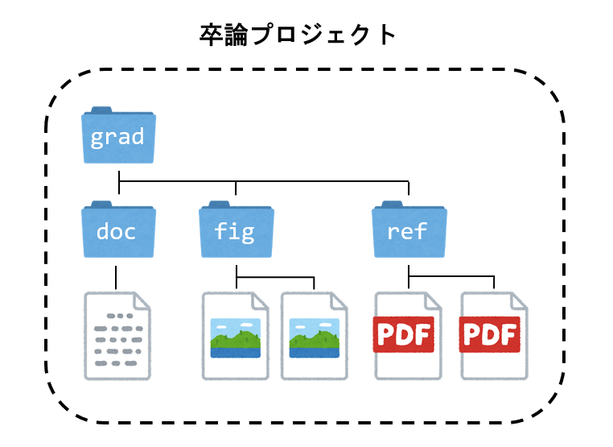
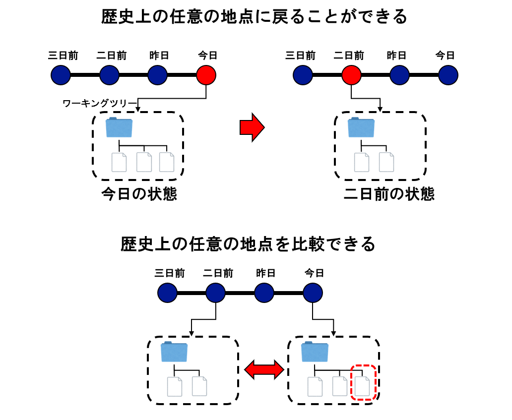
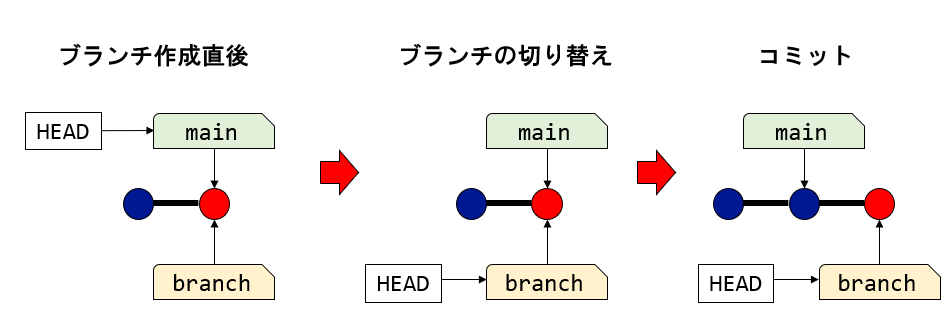
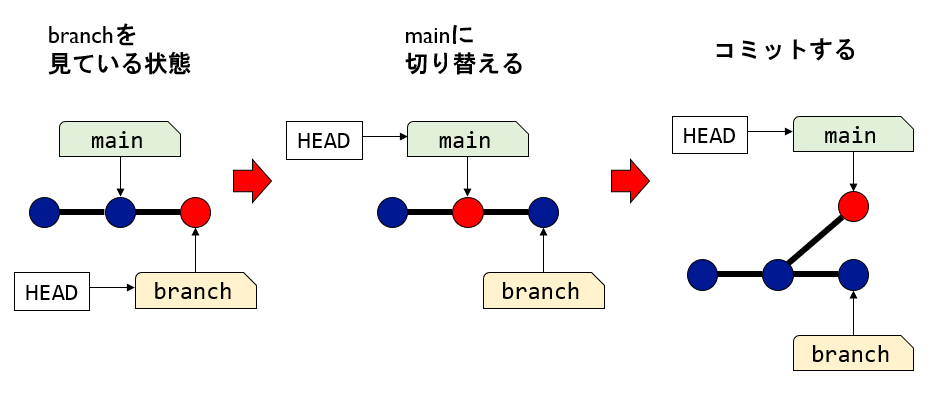
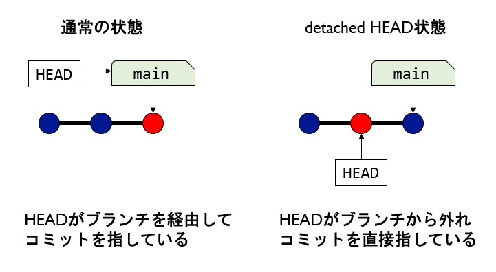
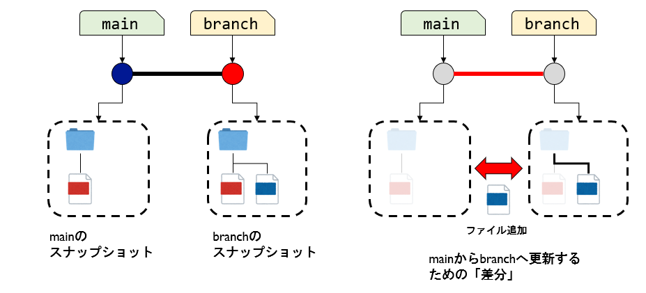
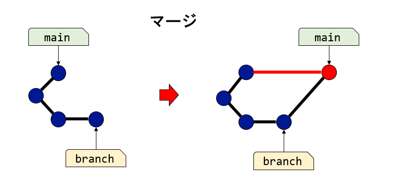

# Gitの仕組みと用語

## はじめに

これからいよいよGitについて学んでいくが、その前に是非伝えておきたいことがある。それは、**Gitの学習は簡単ではない**、ということだ。Gitには多くのコマンドがあり、それぞれが多くのオプションを持っている。トラブルを起こした場合、ある程度の知識がないと復帰が難しい。使い方に自由度が高く、人や組織によって流儀が大きく異る。「Gitは難しい」とまでは言わないが、「Gitは簡単だ」と思って学ぼうとすると挫折する可能性が高い。ある程度じっくりと腰を据えて、用語や仕組み、裏でどのようなことをやっているかを学んで欲しい。慣れてしまえば手放せないツールとなることだろう。

まずはGitで使われる用語を一通り学ぶ。コミットやブランチなど、バージョン管理システムでは共通の単語が使われることが多いが、ツールによって意味合いやニュアンスがかなり異なるので注意が必要だ。Gitの用語はそれを実現するGitのコマンドと一緒に学ぶことが多いが、ここではコマンドは後回しにして、Gitでどういう状態が実現されており、それを何と呼ぶのかを見てみよう。

## プロジェクト

例えばなにかのプログラムを開発する場合、ソースコードだけでなく、ドキュメントやインプットファイル、設定ファイルも一緒に管理したいことが多いだろう。卒業論文を書く場合であれば、論文本体だけではなく、概要や図表、参考文献リストなどもまとめて管理したい。こういった、管理したいファイルやフォルダの集まりを **プロジェクト(project)** と呼ぶことにしよう。なお、これは説明の便利のために導入したもので、特にGitの用語というわけではない。

プロジェクトは、いくつかのファイル、フォルダから構成されているであろう。例えば卒論であれば、卒論本体、図、参考文献などをまとめて管理したくなる。それらを一つのフォルダにいれておくとごちゃごちゃするので、サブフォルダに分けて整理することも多いだろう。例えば卒論本体は`doc`フォルダ、画像は`fig`フォルダ、参考文献は`ref`フォルダ、といった具合だ。以後、プロジェクトに必要なファイルやフォルダをすべて含むトップレベルフォルダ(図では`grad`フォルダ)を、プロジェクトと同一視する場合がある。

## リポジトリとワークツリー

では早速Gitの用語を見ていこう。Gitはファイルの状態や履歴を管理するが、それらの状態を保存する場所が必要だ。その場所を**リポジトリ(repository)** と呼ぶ。リポジトリの実体はプロジェクトの中の`.git`というフォルダである。

現在、自分が作業中のファイルやディレクトリを**ワーキングツリー(working tree)** と呼ぶ[^worktree]。ワーキングツリーはリポジトリの管理下にあるファイルやフォルダである。Git管理下にあるプロジェクトは、リポジトリとワーキングツリーから構成される。

[^worktree]: 英語ではworking treeと呼ぶのが一般的だが、日本語では「ワークツリー(work tree)」という呼び方もされる。

自分の手元のPCにあるリポジトリを**ローカルリポジトリ(local repository)** 、サーバ上にあるリポジトリを**リモートリポジトリ(remote repository)** と呼ぶ。

ワークツリーを持たないリポジトリを**ベアリポジトリ(bare repository)** 、ワーキングツリーを持つリポジトリを**ノンベアリポジトリ(non-bare repository)** と呼ぶ。一般的には、ローカルリポジトリはノンベアリポジトリとして、リモートリポジトリはベアリポジトリとして運用する。

## コミット

Gitが管理するファイルを修正すると、リポジトリにある状態(Gitが覚えている状態)と差が生じる。現在の状態をGitに覚えてもらうために登録することを **コミット(commit)** と呼ぶ。コミットのタイミングと、エディタなどでの保存のタイミングは異なる。例えばワードで「変更履歴の記録」をオンにすると、全ての変更履歴が保存される。しかし、Gitではコミットしたタイミングでのみ履歴の保存が行われる。コミットすると、その時点でのプロジェクトの状態がまるごと保存される。ある時点でのプロジェクトの状態をまとめて **スナップショット(snapshot)** と呼ぶ。

Gitではこの「歴史」を「丸」と「線」で表現することが多い。丸が「ある時点のプロジェクト全体の状態」、すなわちスナップショットであり、線が二つのスナップショットの間の関係、すなわち親子関係を表している。コミットすることで、歴史に丸が追加され、一つ前の丸と線で結ばれる。

Gitでは「コミット」という言葉を2つの意味で使う。一つは動詞であり、新たに「玉」を追加して歴史を伸ばすことを意味する。もう一つは名詞であり、この歴史の中の「玉」、つまりある時点でのすなわちスナップショットそのものを指す。

歴史の「玉」、すなわちコミットはゲームでいうところのセーブファイルのようなものであり、いつでもその状態に戻ることができる。例えばあなたがプログラムを書いていて、いつのまにか正しく動作しなくなっていたことに気が付いたとする。あなたは確か三日前には動いていたのを思い出し、ワーキングツリーを三日前のコミットに切り替える。すると、すぐにプロジェクトが三日前の状態になるので、本当に三日前には動いてたるかどうかをすぐに確認できる。Gitでは、この切り替えが非常に高速であるため、気軽に過去と現在を行ったり来たりできる。動いていることが確認できたら、三日前と現在でどこが違うか、差分を表示したい。Gitはこれも簡単にできる。どのファイルのどの部分が三日前と異なるかが表示されるので、それを見れば問題点の特定も容易であろう。

## インデックスとステージング

Gitには、三種類の「場所」が存在する。現在自分が編集しているファイルが存在するワーキングツリー、ファイルの編集履歴などを保存するリポジトリ、そしてその間にある **インデックス(index)** だ。

Gitでは、修正をリポジトリに登録する(コミットする)前に、インデックスに修正するファイルを登録する必要がある。これを**ステージ(stage)**、もしくは**ステージング(staging)** と言う。そのため、インデックスのことを **ステージングエリア(staging area)** とも呼ぶ。

TODO: ステージング環境についての説明画像

ステージングとは、特にウェブサービスなどの分野で使われる用語だ。例えば、あなたはオンラインショッピングサイトを運用しているとしよう。オンラインショッピングは、ユーザが買い物をするクライアントシステムや、決済や商品管理を行うバックエンド側のシステムから構成されている。さて、クライアント側の認証システムにセキュリティホールが見つかり、早急に対応が必要になったとしよう。このセキュリティホール対策で、どんな影響が出るか全く分からないので、いきなり本番環境に適用するのは怖い。しかし、ローカルで動作検証を行うにも限界がある。そこで、なるべく本番環境と同じ環境だが、ユーザからは見えない場所を作っておき、そこに修正を適用して、動作を確認しよう。そこで問題がなければ、そのまま本番環境に適用すればよい。このように、ローカルと本番環境の間に挟む、リハーサルを行う環境をステージング環境と呼ぶ。ステージング環境を用意することで、本番環境で思わぬ事故が起きる確率を減らすことができる。

Gitでなぜステージングが必要かは追って説明することにして、とにかくGitはステージングを採用しており、修正したいファイルを指定してインデックスに登録してから、インデックスの内容をまとめてスナップショットとしてコミットする、という手順を踏む。

いま、Git管理されていないプロジェクトがあったとしよう。初期化することでリポジトリが作られるが、その中身は空であり、まだなにも歴史を持っていない。

TODO: インデックスとコミットの図解

最初にすることは、どのファイルをGitで管理するか教えることだ。そのためにファイルを選んでステージングする。ステージングされたファイルはインデックスへと登録される。必要なファイルをインデックスに登録し終えたら、コミットをする。インデックスに登録されたファイルが「スナップショット」としてリポジトリに登録され、歴史が生まれる。

リポジトリにコミットが登録されたことで、Gitはファイルの修正を追うことができるようになった。先ほど登録した状態から、ファイルを修正したとしよう。この修正をリポジトリに登録したい。そのために、また修正したファイルをインデックスに登録する(ステージングする)。そして、コミットすることでリポジトリに登録する。以後、この作業を繰り返すことで歴史を作っていくのがGitでの作業である。

## HEADとブランチ

Gitが管理するのはコミットがつながった歴史である。この歴史は枝分かれすることがある。例えばゲームをやっていて、シナリオが分岐する重要なイベントの手間で保存し、両方のシナリオをプレイする、といった経験はあるだろう。さて、バージョン管理システムは歴史を管理するシステムであるが、その扱い方のポリシーには大きな違いがある。Subversionは歴史は一本道であり、原則として歴史の改変を許さない。一方Gitは、歴史は枝分かれすることが普通であり、好きなように歴史を改変する。その歴史操作の手段として使うのがブランチである。

Gitにおけるブランチとはコミットの別名であり、コミットについたラベルだと思えば良い。プロジェクトをGitで初期化した場合、デフォルトで`master`というブランチが用意される[^master]。最初のコミットから歴史が始まるが、そのコミットに`master`というラベルがはりつく。以後、コミットする度に、歴史が増え、`master`というラベルが移動していく。

[^master]: 近年では`master/slave`といった用語が不適切だという意見が広がっており、`master`という言葉を避ける傾向にある。GitHubやGitLabでは、デフォルトブランチを`master`から`main`に変えた。Gitはまだデフォルトブランチは`master`だが、2.28よりデフォルトブランチを変更できるようになっており、いずれデフォルトブランチも`main`となると思われる。

ブランチはコミットについたラベルであり、自由に作ることができる。ブランチが複数あると、「今自分がどのブランチを見ているのか」という情報が必要だ。それを指すのが「HEAD」である。Gitはデフォルトで`master`ブランチが作られ、「HEAD」は`master`を指している。ブランチは、その時に自分が見ているコミット、つまり「HEADが指しているブランチが指しているコミット」に貼りつく。したがって、`master`ブランチで作業している時に新たなブランチ`branch`を作ると、`master`が指すのと同じコミットを`branch`が指す。

さて、ブランチの切り替えとは、「HEADが指すブランチ」を変えることだ。いま、`master`ブランチから`branch`ブランチに切り替えよう。すると、「HEAD」が指す先が`master`から`branch`に変わる。この状態で何かファイルを修正し、コミットしよう。コミットすると歴史が増えるが、この時「いま見ているブランチ(今回の例では`branch`)」の指す先が新たに増えたコミットに移動するが、それ以外のブランチは取り残される。

さて、`branch`が先の歴史を指している状態で、`master`ブランチに戻ろう。HEADが`master`を指した状態となる。ここで何か修正し、コミットしよう。すると、新たに作られたコミットは、`master`が指していたコミットにぶら下がるので、ここで歴史が分岐する。

Gitでは、開発において積極的に歴史を分岐させるが、その意味については後述する。

なお、通常HEADはブランチを経由してコミットを指しているが、操作によってはHEADが直接コミットを指す場合がある。これを「detached HEAD状態」と呼ぶ。detachedとは切り離された、外れている、という意味であり、HEADがブランチから外れていることを意味している。Gitを操作しているとたまにこの状態となるが、その時に慌てないように「detached HEAD状態とはHEADがブランチではなく直接コミットを指している状態である」とだけ覚えておこう。コミットなどの操作は(間接的にせよ直接的にせよ)HEADが指すコミットに対して行われるため、HEADが外れた状態でもコミットなどの操作は可能だ。なぜdetached HEAD状態になるのか、その状態の問題点や、解消の仕方などは後述する。

## マージ

Gitでは、原則として`master`ブランチで作業しない。自分がこれから行う作業に対応したブランチを用意し(ブランチを切る、と呼ぶことが多い)、そのブランチ上で作業を行う。作業が一段落したら、ブランチで作業した内容を`master`ブランチに取り込みたくなる。このように、片方のブランチの修正をもう一つのブランチに取り込むことを **マージ(merge)** と呼ぶ。マージには二種類存在する。一つがFast-Forwardマージ、もう一つがNon Fast-Forwardマージだ[^ff]。

[^ff]: Fast-Fowardマージについては「早送りマージ」と呼ばれることもあるが、あまり一般的でない。また、Non Fast-Forwardマージについては一般的な訳語が無いようだ。

まず、「修正を取り込む」ということの意味を考えてみよう。例えば、`master`ブランチから分岐した`branch`に、ファイルを追加してコミットしたとしよう。すると上図の左のような状態となる。`master`と`branch`の指すコミットは、それぞれの状態のスナップショットを保存しているとのと同時に`master`の指すブランチにファイルを追加したら`branch`の状態になる、と解釈することもできる。

この時、コミットとコミットをつなぐ線は、その二つのコミットの差分(修正)であると解釈できる。Gitの歴史は線でつながった丸で表現されるが、丸が表すスナップショットに、線が表す修正を適用すると、次のスナップショットになる。こうして、それぞれのコミットは一つ前のコミットに「線」が表す修正を「適用」した結果生まれるスナップショットであると理解できる。線が表す修正を次々と適用していけば、線でつながったコミットを再現することができる。

さて、修正を取り込みたいブランチ(`master`とする)が、現在作業中のブランチ(`branch`とする)の直接の祖先であり、かつそこから歴史が分岐していない場合を考えよう。`master`の指すコミットに、「線」が表す修正を適用していった先に目的の状態(`branch`が指すコミット)がある。であるから、`master`の指すコミットに、摘みあがった修正を全て適用したら、`branch`の指すコミットと同じものができあがるはずだ。したがって、`branch`の修正を取り込む(マージする)には、単に`branch`の指すコミットまで`master`を動かせば良い。これをFast-Forward(早送り)マージと呼ぶ。

もし、修正を取り込もうとしているブランチが指すコミットが、現在作業中のブランチが指すコミットの直接の祖先でなかった場合、Fast-Forwardマージはできない。例えば`master`から分岐した`branch`の修正を`master`に取り込もうとした時、`master`にコミットが増えていると、`master`が指すコミットが`branch`の直接の祖先ではなくなる。その場合、両方のブランチの共通の祖先からの修正を両方から取り込んで、二つのコミットを親とする新たなコミットを作る。これをNon Fast-Forwardマージ、もしくは単にマージと呼び、この時作られたコミットをマージコミットと呼ぶ。二つのブランチで同じファイルの同じ場所を修正していた場合、Gitは自動でマージすることができない。これを **衝突(conflict)** と呼ぶ。衝突の対処については後で説明する。

マージしたい二つのブランチのうち、片方が指すコミットがもう片方の直接の祖先である場合はFast-Forwardマージが可能だが、あえてFast-Forwardせずに、マージコミットを作ってマージすることもできる。Fast-Forwardマージをすると、マージ元のブランチがもともとどのコミットから分岐したか、という情報が失われてしまうが、マージコミットを作ると、その情報が残り、例えば間違って実施したマージを取り消しやすい等のメリットがある。

## まとめ

* 歴史とコミット
  * Gitが管理する歴史は「丸」と「線」からなり、「丸」がスナップショット、「線」が二つのコミットの差分を表す
  * 歴史を保存する場所をリポジトリと呼ぶ
  * コミットとは、ある時点でのプロジェクトのスナップショットである
  * スナップショットをリポジトリに登録することをコミットと呼ぶ(コミットには、名詞と動詞がある)。
  * Gitでは、リポジトリに修正をコミットする前に、どの修正を取り込むかをインデックスに登録する必要がある。これをステージングと呼ぶ
* ブランチとマージ
  * ブランチとは、コミットについたラベルである
  * HEADとは、「今見ているブランチ」を指すラベルである
  * 二つのブランチの修正を取り込み、一つの歴史にまとめることをマージと呼ぶ
  * マージする二つのブランチが指すコミットのうち、片方がもう片方の直接の祖先である時、ブランチを移動するだけでマージが完了する。これをFast-Forwardマージと呼ぶ
  * 二つのブランチをマージする際、共通の祖先からの修正を両方取り込んでできた新しいコミットをマージコミットと呼び、マージコミットを作ることで二つの歴史を一つにまとめることをマージと呼ぶ
  * Fast-Forwardマージできる場合でも、マージコミットを作ることができる