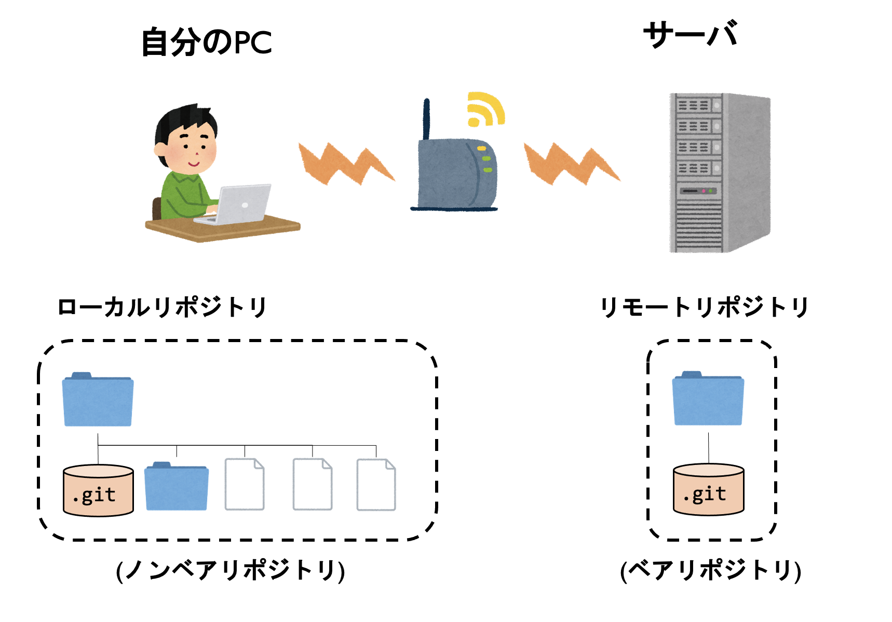
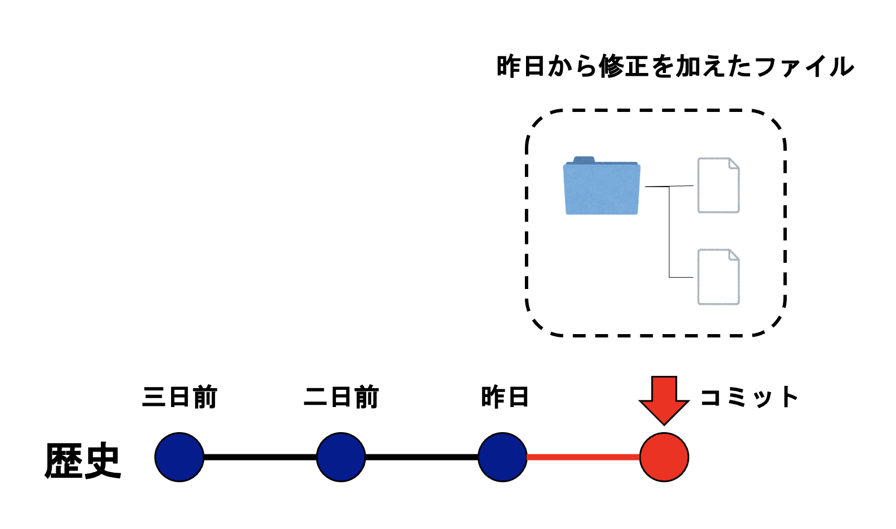

# Gitの仕組みと用語

## はじめに

これからいよいよGitについて学んでいくが、その前に是非伝えておきたいことがある。それは、**Gitの学習は簡単ではない**、ということだ。Gitには多くのコマンドがあり、それぞれが多くのオプションを持っている。トラブルを起こした場合、ある程度の知識がないと復帰が難しい。使い方に自由度が高く、人や組織によって流儀が大きく異る。「Gitは難しい」とまでは言わないが、「Gitは簡単だ」と思って学ぼうとすると挫折する可能性が高い。ある程度じっくりと腰を据えて、用語や仕組み、裏でどのようなことをやっているかを学んで欲しい。慣れてしまえば手放せないツールとなることだろう。

## Gitの用語

まずはGitで使われる用語を一通り学んでいこう。バージョン管理システムで共通の言葉が使われることが多いが、ツールによって意味合いやニュアンスが違ったりするので注意が必要だ。

### プロジェクト

例えばなにかのプログラムを開発する場合、ソースコードだけでなく、ドキュメントやインプットファイル、設定ファイルも一緒に管理したいことが多いだろう。卒業論文を書く場合であれば、論文本体だけではなく、概要や図表、参考文献リストなどもまとめて管理したい。こういった、管理したいファイルやフォルダの集まりを **プロジェクト(project)** と呼ぶことにしよう。なお、これは説明の便利のために導入したもので、特にGitの用語というわけではない。

プロジェクトは、いくつかのファイル、フォルダから構成されているであろう。例えば卒論であれば、卒論本体、図、参考文献などをまとめて管理したくなる。それらを一つのフォルダにいれておくとごちゃごちゃするので、サブフォルダに分けて整理することも多いだろう。例えば卒論本体は`doc`フォルダ、画像は`fig`フォルダ、参考文献は`ref`フォルダ、といった具合だ。以後、プロジェクトに必要なファイルやフォルダをすべて含むトップレベルフォルダ(図では`grad`フォルダ)を、プロジェクトと同一視する場合がある。

### リポジトリとワークツリー

では早速Gitの用語を見ていこう。Gitはファイルの状態や履歴を管理するが、それらの状態を保存する場所が必要だ。その場所を**リポジトリ(repository)** と呼ぶ。リポジトリの実体はプロジェクトの中の`.git`というフォルダである。

現在、自分が作業中のファイルやディレクトリを**ワーキングツリー(working tree)** と呼ぶ[^worktree]。ワーキングツリーはリポジトリの管理下にあるファイルやフォルダである。Git管理下にあるプロジェクトは、リポジトリとワーキングツリーから構成される。

[^worktree]: 英語ではworking treeと呼ぶのが一般的だが、日本語では「ワークツリー(work tree)」という呼び方もされる。

自分の手元のPCにあるリポジトリを**ローカルリポジトリ(local repository)** 、サーバ上にあるリポジトリを**リモートリポジトリ(remote repository)** と呼ぶ。

ワークツリーを持たないリポジトリを**ベアリポジトリ(bare repository)** 、ワーキングツリーを持つリポジトリを**ノンベアリポジトリ(non-bare repository)** と呼ぶ。一般的には、ローカルリポジトリはノンベアリポジトリとして、リモートリポジトリはベアリポジトリとして運用する。

## コミット

Gitが管理するファイルを修正すると、リポジトリにある状態(Gitが覚えている状態)と差が生じる。現在の状態をGitに覚えてもらうために登録することを **コミット(commit)** と呼ぶ。コミットのタイミングと、エディタなどでの保存のタイミングは異なる。例えばワードで「変更履歴の記録」をオンにすると、全ての変更履歴が保存される。しかし、Gitではコミットしたタイミングでのみ履歴の保存が行われる。コミットすると、その時点でのプロジェクトの状態がまるごと保存される。ある時点でのプロジェクトの状態をまとめて **スナップショット(snapshot)** と呼ぶ。

Gitではこの「歴史」を「丸」と「線」で表現することが多い。丸が「ある時点のプロジェクト全体の状態」、すなわちスナップショットであり、線が二つのスナップショットの間の関係、すなわち親子関係を表している。コミットすることで、歴史に丸が追加され、一つ前の丸と線で結ばれる。

Gitでは「コミット」という言葉を2つの意味で使う。一つは動詞であり、新たに「玉」を追加して歴史を伸ばすことを意味する。もう一つは名詞であり、この歴史の中の「玉」、つまりある時点でのすなわちスナップショットそのものを指す。

歴史の「玉」、すなわちコミットはゲームでいうところのセーブファイルのようなものであり、いつでもその状態に戻ることができる。例えばあなたがプログラムを書いていて、いつのまにか正しく動作しなくなっていたことに気が付いたとする。あなたは確か三日前には動いていたのを思い出し、ワーキングツリーを三日前のコミットに切り替える。すると、すぐにプロジェクトが三日前の状態になるので、本当に三日前には動いてたるかどうかをすぐに確認できる。Gitでは、この切り替えが非常に高速であるため、気軽に過去と現在を行ったり来たりできる。動いていることが確認できたら、三日前と現在でどこが違うか、差分を表示したい。Gitはこれも簡単にできる。どのファイルのどの部分が三日前と異なるかが表示されるので、それを見れば問題点の特定も容易であろう。

## インデックスとステージ

Gitには、三種類の「場所」が存在する。現在自分が編集しているファイルが存在するワーキングツリー、ファイルの編集履歴などを保存するリポジトリ、そしてその間にある **インデックス(index)** だ。
