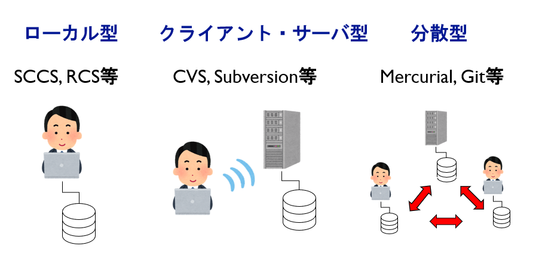

# バージョン管理とは

## バージョン管理システムとは

多くの知的生産活動は「一度作ったら終わり」ではなく、継続的な修正が必要となる。例えば、卒業論文を書くとする。一度書いたら終わりではなく、先生にみせて、真っ赤にされて返ってきて、さらに修正して、ということを繰り返すであろう。また、情報系の学科だったり、それ以外でも数値計算系の研究室や電子機器を制御する研究室に所属した場合は日常的にプログラムを書くことになるだろう。それらのプログラムも、使っているうちに機能を追加したくなったり、見つけたバグを修正したくなったりするであろう。明示的に気にしていなくても、何かを修正、保存するたびに、そのドキュメントやプログラムの「バージョン」は上がっていくことになる。そのドキュメントやプログラムを複数人で修正したり、一人でも複数の場所で開発していたりすると、「バージョン」の管理が難しくなる。例えば家で修正した最新版の卒論ではなく、大学のPCに入っていたちょっと古いバージョンのものを先生に渡してしまい、朱入れされて返ってきたものを見て、古い奴を渡したことに気が付いて気まずい思いをしたり、なんてことがあり得る(実話)。また、手元のPCで開発していたコードをスパコンに持って行ってそこで動くように修正し、スパコンで実行中に手元のコードを修正して、またスパコンに持っていったら、スパコン上で行った修正を上書きしてしまった、なんてことも起きる(実話)。また、多人数で開発をすすめると、誰がどこを修正したかがわかりにくくなる。例えば、複数の人が一つのWordファイルを回り持ちで修正し、「仕様書_佐藤修正_吉本追記.docx」というファイルと「仕様書_最終版_田中追記.docx」のどちらが最新版かわからなくなる、といったことが起きる。こういった悲(喜)劇を防ぐのがバージョン管理システム(Version Control System, VCS)である。

バージョン管理システムは、その名の通りファイルのバージョンを管理するためのツールである。いつ、誰が、どこを修正したかを履歴記録し、必要とあれば古いバージョンを参照し、その差分をチェックすることができる。また、複数人が同じファイルを同時に編集してしまった場合に、その両方の変更を取り込む支援を行う。現在、バージョン管理システムを使わないソフトウェア開発は考えられず、プログラムの開発をともなう部署は、どのツールを使うかはともかく、少なくともなんらかのバージョン管理システムを採用しているものと思われる[^dash]。

[^dash]: もしバージョン管理システムを採用しておらず、日付やエクセルなどでバージョン管理をしている会社に入ってしまったらダッシュで逃げること。

## バージョン管理システムの歴史

簡単にバージョン管理システムの歴史を見てみよう。世界初のバージョン管理システムはSource Code Control System (SCCS)であり、1972年、IBMのSystem/370向けに開発され、後にPDP-11上に移植された。次いで、1982年にRevision Control System (RCS)というシステムが開発された。RCSはファイル単位でバージョンの管理を行い、プロジェクトという概念も無かった。また、ファイルを修正する際にロックをかけるのが特徴で、誰かが作業している場合、他の人が作業することはできなかった。

ここまでのシステムはローカルに管理用のディレクトリを置いてバージョン履歴をそこに保存する形式(ローカル型)であったが、1986年に作られたConcurrent Versions System (CVS)から、クライアント―サーバ型となった。CVSサーバはプロジェクトの全履歴を保存しており、クライアントはサーバに接続して任意のバージョンを取り出すことができ、修正したらサーバにその変更を保存することができる。CVSは、ネットワーク越しにRCSを使うフロントエンドとして構築されており、キーワード展開やコマンド名など多くの機能がRCSに由来している。CVSは長い間、バージョン管理システムのデファクトスタンダードとして広く使われていたが、ファイル名を変更すると履歴が失われてしまったり、バージョン管理がファイルごとであるために「全体をこの日のバージョンに戻したい」といった操作が面倒であるなど、不満も多かった。それらの不便を解消し、CVSの置き換えを目指して作られたのがSubversionである。Subversionはバージョンがプロジェクト(リポジトリ)単位であり、プロジェクトに含まれるファイルを一つでも更新すると、全体のバージョンがあがる。したがって、「この日のバージョンが欲しい」といったことが容易にできる。また、ファイル名の変更をサポートしており、ファイル名を変えても履歴が失われないなど、CVSの不満の多くが解消されている。また、履歴を差分で保存するため、長い間開発していてもファイル容量を圧迫しづらいように工夫されていた。Subversionはその目的通りにCVSを置き換え、最も使われるバージョン管理システムとなった。

Subversionに代表される中央集権クライアントーサーバ型のバージョン管理システムは、全ての歴史を持つデータが一か所に保存されているのが特徴であり、これは利点でもあるが、弱点でもあった。大事なデータベースが一か所にまとまっているというのは管理が楽になる一方、そのサーバが単一障害点(single point of failure, SPOF)となり、その一か所が止まってしまうと全ての作業が停止してしまい、そのデータが失われてしまうと全ての歴史が失われてしまう、という問題があった。そこで、分散型のバージョン管理システムが生まれた。分散型は、それぞれローカルに全ての履歴を持ち、ローカルに変更を保存できる。そして、必要に応じて別のマシンと同期を取ることで変更履歴を共有する。分散型バージョン管理システムの最初期のものはBitKeeperであろう。これは商用ソフトウェアであったが、オープンソースソフトウェアの開発にはコミュニティ版を無料で使うことができた。特に、大量のパッチを処理する必要があるLinuxカーネルの開発に使われたことで有名となった。しかしその後、BitKeeperの開発元であるBitMover社とLinuxカーネル開発者がトラブルを起こし、BitKeeperが使えなくなってしまった。こうして別のシステムが必要となり、GitやMercurialといったオープンソースのシステムバージョン管理システムが生まれた。オープンソースの分散型のバージョン管理システムとしては他にもGNU ArchやMonotone等があり、最初のリリースはGitやMercurialよりも早かったが、広く使われることはなかった。Eclipse communityの2009年のアンケートではSubversionの使用率が57.5%でトップ、次いでCVSが20%で二位であり、Gitの使用率は2.4%に過ぎなかった。しかし、2011年に12.8%、2022年に23.2%と急増し、2014年には33.3%となって、同年30.7%だったSubversionを抜いて一位となっている。2015年に行われたStackOverflowというサイトのアンケートでは、バージョン管理システムとして最も使われているのがGitで69.3%、次いでSubversionが36.9%であったが、2018年にはGitが87.2%でトップ、Subverionが16.1%で二位と、Gitの一人勝ち状態になった[^stackoverflow]。以上のようにGitは2010年頃から急速にシェアを伸ばし、2015年頃にはSubversionを抜いて一番使われるシステムになったようだ。

以上のように、バージョン管理システムはローカル型(SCCS, RCS)からネットワーク越しに使える中央集権クライアント―サーバ型(CVS, Subversion)へ、そして各クライアントが情報を持つ分散型(BitKeeper, Mercurial, Git)へと進化していった。バージョン管理システムができてから三十余年、概ね5年から10年程度で世代交代が起きている。今はGitが広く使われているが、今後どうなるかはわからない。新たなツールが普及した時に、そのメリットとデメリットを見定め、必要とあれば乗り換える柔軟性が必要だ。

[^eclipse]: [Eclipse community survey 2009](http://www.eclipse.org/org/press-release/Eclipse_Survey_2009_final.pdf), [Eclipse community survey 2014](https://www.slideshare.net/IanSkerrett/eclipse-community-survey-2014)
[^stackoverflow]: [StackOverflow Survey 2015](https://insights.stackoverflow.com/survey/2015), [StackOverflow Survey 2018](https://insights.stackoverflow.com/survey/2018#work-_-version-control)

## プログラミングのできる人、できない人

どの分野でも見られることだと思うが、特にプログラミングにおいては「できる人」と「できない人」の差が激しく、生産性が10倍、100倍と桁で違うことも珍しくない。ここで「生産性」という言葉を使ったが、プログラミングにおける生産性を定量的に定義することは難しい。プログラムの生産性は、例えば(よくダメな組織で行われているように)一日に入力したプログラムの総行数で測ることはできない。プログラムが「できる人」は、別にキー入力が速いわけではない。また、プログラムに必要な知識が全て頭に入っているわけでもなく、よく構文を忘れて検索していたりする。では、「できる人」と「できない人」ではどこで一番差が出るか。個人的な経験では、それはデバッグの時間だと思われる。デバッグとは、プログラムに入ったバグを取り除く作業だ。バグとは、プログラムが意図しない動作をする、その原因である。「できない人」は、作業時間のほとんどを、このデバッグに費やしている。一方、「できる人」は、作業時間のほとんどを純粋な開発に使っている。開発しているコードが大きくなればなるほど、開発期間が長くなるほどその差は開き、同じバグに直面しても、「できる人」が短時間で対処するのに、「できない人」は、そのデバッグだけで一日が終わってしまった、といったことが起きる。具体的な例をみてみよう。

あなたが卒業研究用の数値計算コードを書いていて、エネルギーが保存されなくなっていることに気が付いたとする。エネルギーが保存すべき系を計算しているので、このコードはどこか間違っている。したがって、その全ての出力結果は信頼することができず、それを修正するまでは他の全ての作業がストップする。デバッグの開始である。あなたはコードを最初から最後まで詳細に調べ、どこで間違っているかを考える。一度見ただけでは問題は見つからず、なんどもなんども読み返す。最近、どんな変更をしたかを思い返し、そこを元に戻してみるが、まだおかしい。そのうち、修正していなかったところを変な風に直してしまい、だんだん収拾がつかなくなる。そうしてずっとコードの中をさまよった結果、ついにバグの原因を発見。コードに機能追加する際にif文を追加したのだが、その条件漏れだった。外を見ると夜が白みはじめている。12時間以上集中していたようだ。今日もよくがんばった。明日からまた開発を続けよう・・・

もしあなたがバージョン管理システムを使っていたなら、同様なバグに異なる対処をする。「できない人」はバグを見つけたらコードを読み返して、頭の中で仮想実行することでバグを発見しようとした。しかし、バージョン管理している人はそういうことをしない。まず、現在のコードが確実にバグっていることを確認する。次に、十分に古いバージョンを取ってきて、同じ計算をさせてみる。すると、エネルギーは保存している。昔はバグっていなかったが、現在はバグっている、つまり、どこかでバグが入ったはずだ。そのあとは二分探索だ。徐々に「容疑者」の範囲を狭めていき、バグがない最も新しいバージョンと、バグがある最も古いバージョンを特定すれば良い。もしあなたがGitに慣れているのなら、`git bisect`を使うかもしれない。あなたはまず、コードが「バグっているか」「バグっていないか」を機械的に判定するスクリプトを書く。今回の例なら、ある入力からシミュレーションして、エネルギーが一定の範囲内に収まっていればバグっていない。そこからはみ出せばバグっている、そのチェックスクリプトを書く。そんなスクリプトならものの5分もあれば書けるであろう。そして、おもむろに`git bisect`というコマンドをたたく。これは、バグ判定テストスクリプトを食わせると、どこでそのスクリプトが初めて失敗するかを探索してくれるコマンドだ。これにより、あるバージョンまではバグっておらず、次のバージョンでバグが入った、ということがわかる。計算の詳細にも寄るが、長くても10分程度でバグが入った箇所を特定できるであろう。バグが入った場所を特定してしまえば、あとはその差分を見れば良い。if文を含む数行が追加されている。これがバグの導入箇所だ。そこまで来て初めて頭を使う。条件が漏れていると気づく。あなたは余計な場所をいじることなくそこだけを修正し、デバッグ完了だ。ここまで、せいぜい1時間かかるかどうか。

プログラミングに慣れていない人は、往々にしてこのようにデバッグに時間をかけがちである。デバッグは絶対に行わなければならない作業であり、達成条件も明確であることから、デバッグをしていると「仕事をしている」という実感が強いのだが、実際には自分でいれたバグを自分でとっているだけであり、プロジェクトとしては何ら前に進んでいない。あなたが研究室で12時間ぶっ続けでデバッグをしている間、別の人は4時間くらいかけて新機能を実装し、2時間くらいかけてその結果を確認、うまくいってそうなのでスパコンにジョブを投げ、気になっていたドラマの続きを見ながらご飯を食べ、ゆっくりお風呂に入ってさっさと寝ているかもしれない。外から見て「がんばっている」ように見えるのは12時間ぶっ続けデバッグの人だが、もちろん実際に研究が進んでいるのは後者の人だ。

ここで「GitやGitHubなどのツールを使うとデバッグ時間が短くなる」と言いたいわけでは**ない**ことを強調しておきたい。「できない人」はバグを見つけたらコードを読み返して、頭の中で仮想実行することでバグを発見しようとした。また、自分が過去にどんな修正をしたか、思い出そうとした。つまり、頭を使おうとした。しかし「できる人」の例では、デバッグで徹底して頭を使っていない。なるべく機械的にバグの範囲を時間的、空間的に狭めていき、最後の最後でちょっと頭を使うだけでデバッグを完了している。ここでGitはこの方針のデバッグを補助するためのツールとして使われており、おそらく、Gitを使っていなかったとしても似たような時間でデバッグを完了していたであろう。もちろんGitなどのツールは便利であり、うまく使えばデバッグ時間を飛躍的に短くすることができる可能性がある。しかし、Gitは、あくまで何かしらの開発スタイルを支援するためのツールなのであって、そのような開発スタイルが身についていない人が形だけ導入しても効果を得ることはできない[^notebook]。ツールとしてのGitの使い方そのものより、なぜそのコマンドがあるか、どのような場合に使うか等の「思想」を共に学ばなければ意味はない。

[^notebook:] 有名人が使っているのと同じ手帳を使っても、有名人と同じ活躍はできないのと同様である。

## まとめ

ドキュメントやソフトウェアのバージョンを管理するためにバージョン管理システムは生まれた。バージョン管理システムが更新履歴を覚えてくれているおかげで、誰が、いつ、どんな変更をしたかを覚えなくて良い。複数人での開発で特に有用なツールであるが、一人で開発、修正していプロジェクトにおいてもバージョン管理システムは有用だ。三日後の自分は他人である。コードを書いて三日も経てば、間違いなく自分がどんな気持ちでどんな修正をしたかを忘れているだろう。それを教えてくれるのがバージョン管理システムである。そういう意味で、バージョン管理システムは超優秀な秘書のようなものだ。うまく使いこなせば生産性を非常に高めることができるが、使いこなせなければただのバックアップにしかならない。自分の開発手法にツールを合わせるというよりは、ツールを通じて開発手法を学ぶ、という気持ちでいた方が良い。
